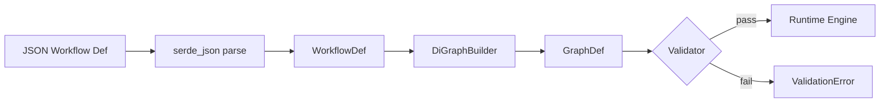
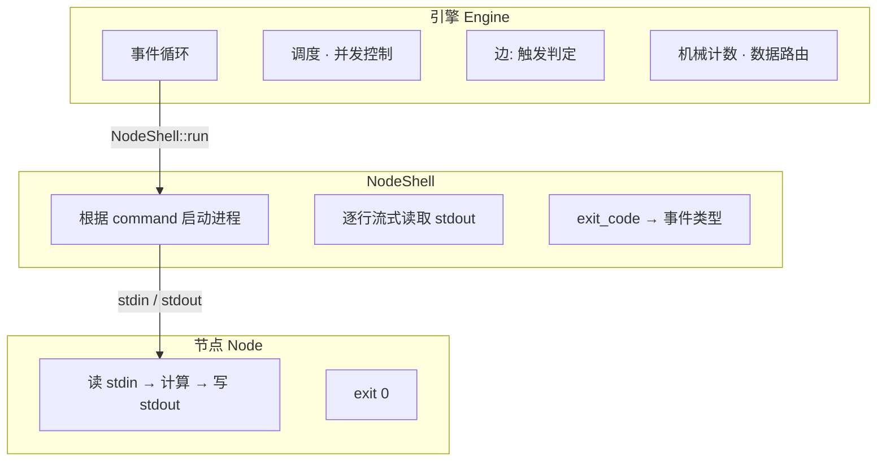

# Nexus

> **有向图驱动的插件编排引擎** — 任何子进程都是节点，退出码决定完成，stdout 即结果。

---

Nexus 是一个低层级的工作流编排引擎。你将工作流定义为一张有向图：节点就是子进程，边就是触发条件。没有中心化的流程控制器——每个节点只带自己的计数器和出边规则，引擎反复问每个节点「你的条件满足了吗」，直到所有人都说「不满足了」。



## 为什么用 Nexus？

Nexus 提供的是基础设施，不是抽象——它不封装你的业务逻辑，也不猜测你的节点类型：

- **进程即节点** — 任何 stdin/stdout 的子进程都可以成为节点。Python、PowerShell、Rust、Node.js、OpenCode、Claude Code——不改引擎代码。
- **退出码即完成** — exit 0 = 完成，非 0 = 失败。这是判断进程结束的唯一方式。不依赖超时、不依赖心跳、不依赖最后一行 JSON。
- **逐行流式输出** — 每行 stdout 在节点运行时实时上报（`--verbose` 可见）。进程不需要等退出——中间结果实时可观测。
- **无节点类型耦合** — 没有 AI executor、没有 HTTP executor。所有节点统一为 `type: "subprocess"`。引擎不感知节点类型。
- **边驱动调度** — 边由四个正交维度定义：事件类型（Complete/Failed/Timeout）、返回值（exit_reason）、组合逻辑（All/Any）、阈值（threshold）。不需要第五种维度。
- **调度拓扑 ≠ 数据拓扑** — `edges` 决定谁完成后谁开始，`dataflows` 决定谁的数据传给谁。两张独立的图。

## 快速开始

```bash
# 验证工作流
nexus-cli run test_workflow.json --validate-only

# 运行一个工作流
nexus-cli run test_workflow.json

# 查看流式输出
nexus-cli run test_workflow.json --verbose

# 完成后输出节点状态
nexus-cli run test_workflow.json --dump-state
```

## 工作流定义

工作流由三部分组成：节点（nodes）、调度边（edges）、数据流（dataflows）。

```json
{
  "nodes": [
    {
      "id": "fetch_data",
      "providers": [{"type": "subprocess", "command": "python fetcher.py"}],
      "process_timeout_secs": 30
    },
    {
      "id": "validate",
      "providers": [{"type": "subprocess", "command": "python validator.py"}],
      "process_timeout_secs": 10,
      "predecessors": [
        {"node_id": "fetch_data", "trigger": "all", "event": "complete"}
      ],
      "inputs": ["fetch_data"]
    }
  ]
}
```

所有工具统一通过 `type: "subprocess"` 接入：

**OpenCode：**
```json
{
  "type": "subprocess",
  "command": "opencode run --format json --dangerously-skip-permissions -- \"review this code\""
}
```

**Claude Code：**
```json
{
  "type": "subprocess",
  "command": "claude -p \"review this code\" --output-format json --model claude-sonnet-4"
}
```

**链式传递上游数据（模板插值）：**
```json
{
  "type": "subprocess",
  "command": "opencode run --format json --dangerously-skip-permissions -- \"{{inputs.config}}\""
}
```

## 工作原理

### 三层架构



### 执行流程

```
Scheduler → 决定谁 ready
    ↓ NodeReady
Semaphore → acquire() 等空位
    ↓ spawn
SubprocessExecutor → stdin 写 JSON + 逐行读 stdout（实时 chunk）+ wait
    ↓ stdout（逐行实时）
DataRouter → 存储输出，传递给下游
```

### 边触发算法

```
for each out_edge of completed_node:
  1. 如果边已被触发，跳过
  2. 如果事件类型不匹配，跳过
  3. 如果 exit_reason 配置了且不匹配，跳过
  4. All 策略：如果 received 未包含所有上游，跳过
  5. event_count++
  6. event_count >= threshold → triggered=true, 入队目标节点
```

### 重试机制

节点 Failed 或 Timeout 后，默认最多重试 3 次：

```
节点 Failed/Timeout
  → retry_count < max_retries (默认 3)?
    → retry_count++ → 重新执行节点
  → 否则触发 Failed/Timeout 出边
```

## CLI

```
nexus-cli run <workflow.json>

  --max-concurrency N    最大并发节点数（默认：CPU 核数）
  --node-timeout S       节点默认超时秒数（默认：3600）
  --verbose              详细日志（含流式 chunk 输出）
  --validate-only        仅验证，不执行
  --dump-state           输出节点状态快照

退出码：
  0  Success
  1  Validation error
  2  Runtime error
  3  Idle timeout
```

## 模式

| 模式 | 说明 |
|------|------|
| 链式 | A → B → C，严格顺序执行 |
| 扇出/扇入 | A → B, A → C → D（All 等待全部完成） |
| 条件分支 | review → approved/deploy, rejected/fix（exit_reason 路由） |
| 带阈值循环 | collector 自环 3 次后触发 aggregator（threshold: 3） |
| 错误处理 | A(Complete → B, Failed → error_handler) |
| 并行聚合 | A, B, C 同时执行 → M 等待全部完成（All） |

详细模式模板见 [`references/WORKFLOW_REFERENCE.md`](./references/WORKFLOW_REFERENCE.md)。

## crate 划分

```
nexus-engine/    ← 核心引擎库（lib crate）
nexus-cli/       ← 命令行工具（binary crate，1.5MB 静态链接）
nexus-mcp-server/← MCP 服务器（JSON-RPC stdio 协议）
```

## 构建

```bash
# 构建
cargo build --release

# 打包（独立分发）
powershell -File scripts\package.ps1
```

产物在 `nexus-dist/` 目录——单个 `nexus-cli.exe`（1.5MB），零运行时依赖。

## 系统要求

- 编译：Rust 1.83+ (edition 2024)
- 运行：Windows (GNU/MSVC) 或 Linux

---

**Nexus 不封装你的逻辑。它只提供图的骨架。你把骨架填上子进程，它就跑。**
