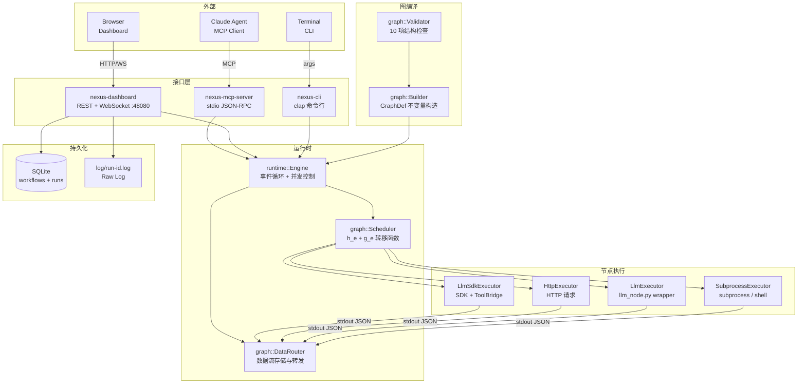
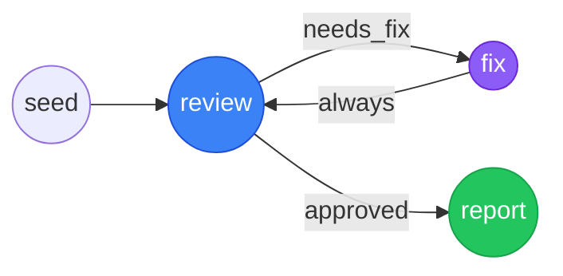
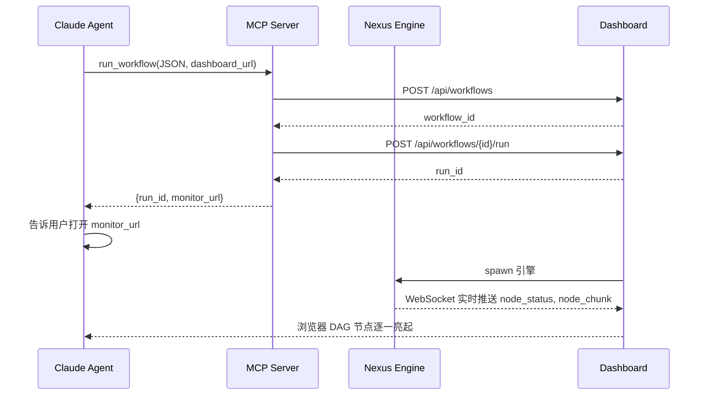

# Nexus

> 有向图驱动的插件编排引擎 —— 定义 DAG 工作流，引擎机械执行，Dashboard 实时监视。

<p align="center">
  
  
  
  
</p>

---

## 架构总览



## 定位

| Claude Subagent | Nexus Workflow |
|---|---|
| 模型驱动，探索式 | 固定拓扑，确定性 |
| "找找这个项目的 bug" | "代码审查 → 修复 → 复盘" |
| LLM 做每步决策 | 引擎按 exit_reason 机械路由 |
| 适合未知探索 | 适合已知流程、重复执行 |

**Claude 定义 JSON → Dashboard 加载 → 引擎执行 → Dashboard 实时监视 → 必要时人工介入。**

## 快速开始

```bash
git clone git@github.com:Asher0501/Nexus.git
cd Nexus/engine
cargo build --release

# CLI
./target/release/nexus-cli run ../release/examples/http-test.json --verbose

# Dashboard
./target/release/nexus-dashboard
# → http://127.0.0.1:48080

# MCP
echo '{"jsonrpc":"2.0","method":"describe_schema","params":{},"id":1}' \
  | ./target/release/nexus-mcp-server
```

## 核心特性

| 特性 | 实现 |
|------|------|
| **h_e + g_e 正交分解** | 边 = 纯函数分支匹配 + 策略聚合，无 triggered 状态，环路自然支持 |
| **5 种 Provider** | subprocess / shell / http / llm (CLI) / llm_sdk (SDK + ToolBridge) |
| **HTTP Provider** | 声明式 HTTP 请求，GET/POST/PUT/DELETE/PATCH，模板插值，响应路由 |
| **ToolBridge** | llm_sdk 内置 read_file / write_file / execute_command，支持 MCP server 扩展 |
| **route_policy** | max_runs (轮次上限) 或 max_duration (时间上限) 终止循环 |
| **调度/数据分离** | `edges` 控制执行顺序，`dataflows` 控制数据流向，独立声明 |
| **引擎级 sanitize** | 自动过滤 lone surrogate，PYTHONIOENCODING=utf-8 管道 |
| **实时可视化** | WebSocket 推送 + vis-network DAG 实时着色 + Stop 按钮 |
| **MCP 深度集成** | stdio JSON-RPC，可代理到 Dashboard 获得实时监控 |
| **10 项结构验证** | Validator 静态检查 DAG 合法性 |

## 工作流示例



> 4 节点审查循环：review → fix → review → ... → approved → report。`route_policy.max_runs` 保证终止。

## Claude Code 集成流程



## MCP 工具

| 工具 | 说明 |
|------|------|
| `validate_workflow` | 验证 JSON 结构 + DAG 拓扑合法性 |
| `parse_workflow` | 解析 JSON 返回 GraphDef |
| `describe_schema` | 返回 WorkflowDef JSON Schema |
| `run_workflow` | 执行工作流，支持 `dashboard_url` 代理 |

## 项目结构

```
Nexus/
├── engine/                     # Rust workspace
│   ├── crates/
│   │   ├── engine/             # 核心引擎 (210 tests)
│   │   ├── cli/                # 命令行
│   │   ├── mcp-server/         # MCP 服务器 (11 tests)
│   │   └── dashboard/          # Dashboard 后端 (20 tests)
│   └── scripts/                # Python wrapper
│       ├── nexus_protocol.py   # 共享协议层
│       ├── tool_bridge.py      # ToolBridge (MCP + 内置工具)
│       ├── llm_sdk.py          # Anthropic SDK wrapper
│       └── llm_node.py         # LLM CLI wrapper
├── release/                    # 分发包
│   ├── bin/                    # 预编译二进制 (Win + Linux)
│   ├── scripts/                # 运行时脚本
│   ├── static/                 # Dashboard 前端 + 示范工作流
│   ├── examples/               # 示例工作流 (HTTP, review-loop, max-duration)
│   └── *.md                    # 文档
└── .claude/skills/             # Claude Code Skill
```

## 文档

| 文档 | 内容 |
|------|------|
| `release/README.md` | API 参考、系统要求、构建说明 |
| `release/QUICKSTART.md` | 5 分钟上手 + 示范用例，覆盖全部特性 |
| `release/WORKFLOW_REFERENCE.md` | 工作流定义完整参考 — schema、调度语义、模式模板、边界情况 |
| `release/NEXUS_WORKFLOW_SKILL.md` | Claude Code 生成工作流的 Skill 参考 |
