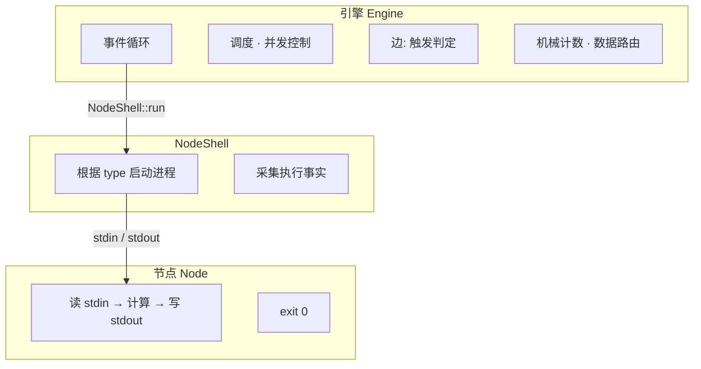
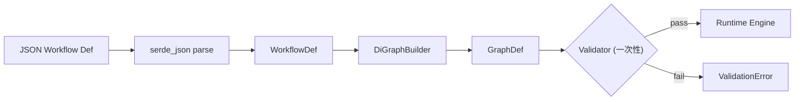
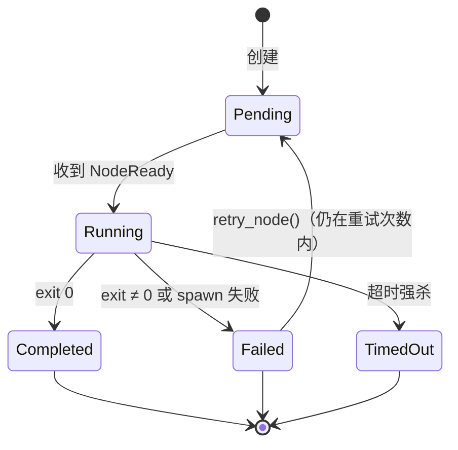
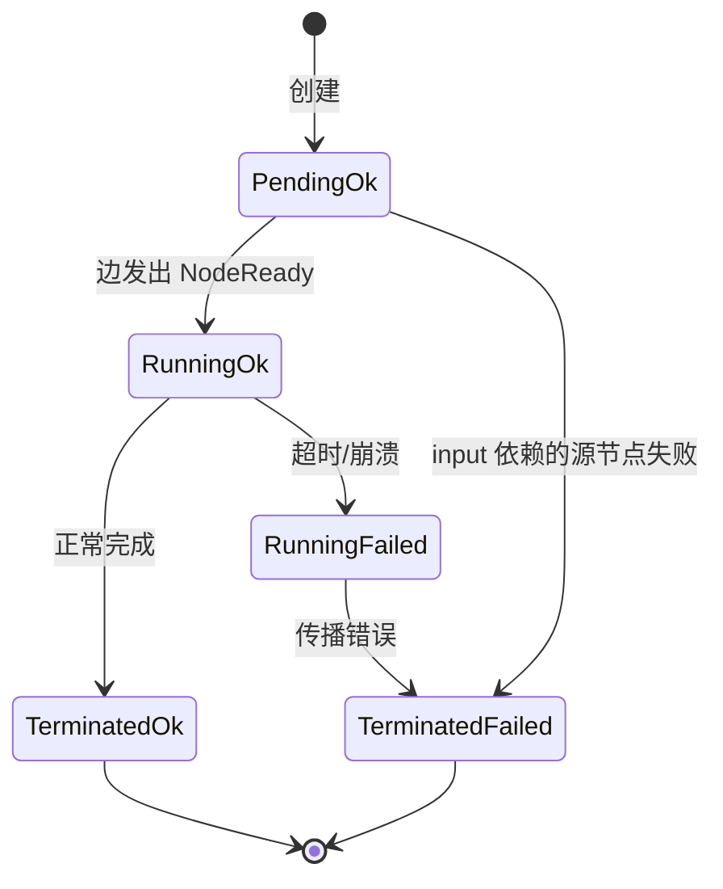
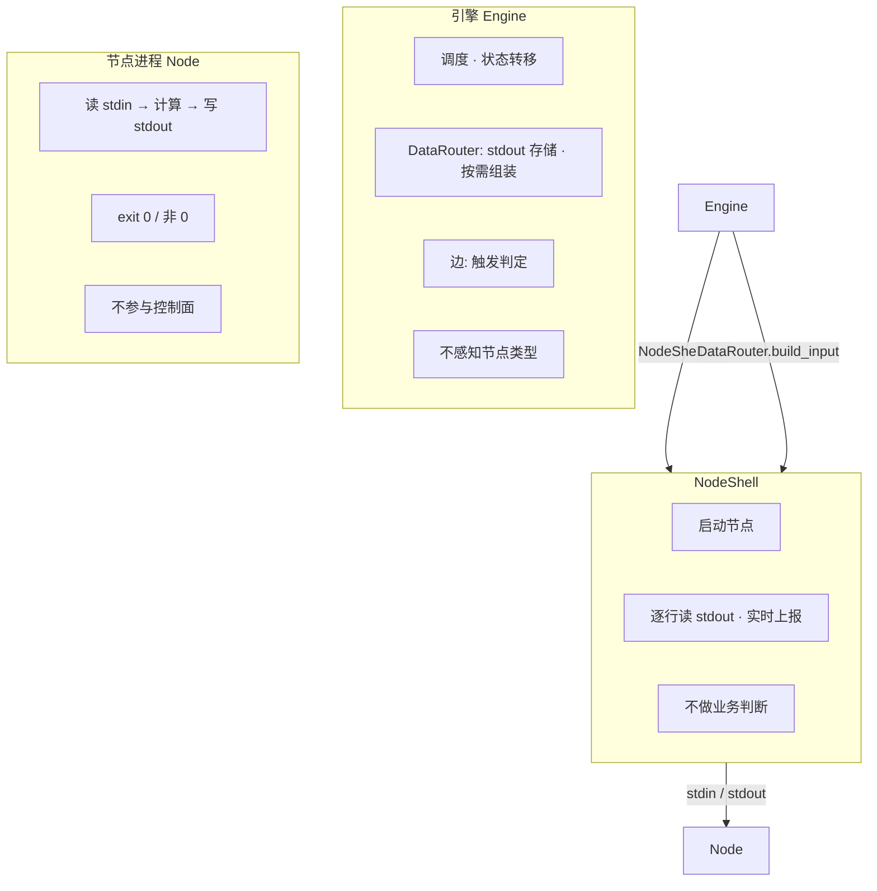

# Nexus — 架构文档

> Nexus 是一个有向图驱动的插件编排引擎，基于**局部闭包定理**（见 [理论/DESIGN_PHILOSOPHY.md](../theory/DESIGN_PHILOSOPHY.md)）：全局执行轨迹 = 每个节点局部转移函数的迭代闭包。采用 Syntax/Semantics 分离的设计原则（见 §十），将工作流定义、图分析、运行时调度与节点执行解耦。

**分类**：design

---

### 术语表

| 术语 | 英文 | 含义 |
| --- | --- | --- |
| **节点完成** | Node completion | 子进程退出，产生 `NodeCompleted` 事件（无论 exit_code 是否为 0） |
| **边触发** | Edge firing | 边满足条件（event 匹配、All 到齐、threshold 达到），`triggered = true`，目标节点入队 |
| **工作流收敛** | Workflow convergence | 所有节点到达终态，`running_count == 0 && ready_queue.is_empty()`，引擎停止 |

文档中"完成"单独出现时默认指"节点完成"。

---

## 一、系统结构

### crate 划分

```
nexus-engine (lib)       ← 核心引擎库
nexus-cli (binary)       ← CLI 入口：nexus run <workflow.json>
```

### 引擎内部模块

```
nexus-engine
├── Workflow Model        ← JSON 反序列化 → WorkflowDef
├── Graph Engine          ← 语法层：建图 + 统一验证
│   ├── Builder           ← WorkflowDef → GraphDef
│   └── Validator         ← 运行前一次性验证（内部含多项检查）
├── Runtime Engine        ← 语义层：事件循环 + 调度 + 执行
│   ├── Event Loop        ← 事件通道（mpsc channel）+ 主循环
│   ├── Scheduler         ← 收 NodeReady → 并发控制 → handle_event
│   ├── Executor          ← 调 DataRouter 组装输入 → NodeShell::run()
│   ├── Edge              ← EdgeDef / EdgeState (Complete/Failed/Timeout)
│   └── Data Router       ← 上游输出 → 下游输入的组装
├── NodeShell             ← 适配层：屏蔽节点类型差异
│   ├── NodeExecutor enum ← Subprocess / Http
│   ├── SubprocessExecutor← 子进程执行器（async fn run，含逐行流式输出）
│   ├── NodeChunk         ← 实时输出片段（每行 stdout 实时上报）
│   └── HttpExecutor      ← HTTP 执行器（未来扩展，async fn run）
└── Test Framework
    └── Pattern Tests     ← 5 种模式 × 状态 × Outcome
```

### 三层架构



---

## 二、工作流定义语言

### 核心数据结构

工作流由两张独立的图定义：**调度拓扑**（谁完成后谁可以开始）和**数据拓扑**（谁的数据传给谁）。

```rust
#[derive(Debug, Clone, Serialize, Deserialize)]
pub struct WorkflowDef {
    pub nodes: Vec<NodeDef>,
    #[serde(default)]
    pub edges: Vec<SchedulingEdgeDef>,       // 调度拓扑
    #[serde(default)]
    pub dataflows: Vec<DataFlowDef>,         // 数据拓扑
}

#[derive(Debug, Clone, Serialize, Deserialize)]
pub struct NodeDef {
    pub id: String,
    pub providers: Vec<ProviderDef>,
    pub process_timeout_secs: u64,
    pub max_concurrency: Option<usize>,
    #[serde(default)]
    pub returns: Vec<String>,
    #[serde(default)]
    pub max_retries: Option<u64>,
}
```

入口节点由 Builder 自动识别（`edges` 中没有入边的节点）。

### SchedulingEdgeDef — 调度拓扑

```rust
#[derive(Debug, Clone, Serialize, Deserialize)]
pub struct SchedulingEdgeDef {
    pub from: String,
    pub to: String,
    pub trigger: TriggerExpr,
    pub event: EventType,
    #[serde(default)]
    pub exit_reason: Option<String>,
    #[serde(default = "default_threshold")]
    pub threshold: u64,
}

pub enum TriggerExpr { All, Any }
pub enum EventType { Complete, Failed, Timeout }
fn default_threshold() -> u64 { 1 }
```

### DataFlowDef — 数据拓扑

```rust
#[derive(Debug, Clone, Serialize, Deserialize)]
pub struct DataFlowDef {
    pub from: String,
    pub to: String,
    /// 数据在目标节点 inputs 中的 key。未配置时使用 from 节点 ID。
    #[serde(default)]
    pub alias: Option<String>,
}
```

### 完整示例

```json
{
  "nodes": [
    { "id": "fetch_data", "providers": [{ "type": "subprocess", "command": "python fetcher.py" }], "process_timeout_secs": 30 },
    { "id": "validate", "providers": [{ "type": "subprocess", "command": "python validator.py" }], "process_timeout_secs": 10 },
    { "id": "review", "providers": [{ "type": "subprocess", "command": "python reviewer.py" }], "process_timeout_secs": 120, "returns": ["approved", "rejected"] },
    { "id": "notify", "providers": [{ "type": "subprocess", "command": "python notifier.py" }], "process_timeout_secs": 10 }
  ],
  "edges": [
    { "from": "fetch_data", "to": "validate", "trigger": "all", "event": "complete" },
    { "from": "fetch_data", "to": "review", "trigger": "all", "event": "complete", "threshold": 5 },
    { "from": "fetch_data", "to": "notify", "trigger": "all", "event": "failed" }
  ],
  "dataflows": [
    { "from": "fetch_data", "to": "validate" },
    { "from": "fetch_data", "to": "review" }
  ]
}
```

`review` 的 `threshold: 5` 表示 `fetch_data` 正常完成 5 次后才触发 review。前 4 次 threshold 未到，不触发下游。

---

## 三、Graph Engine（语法层）

Graph Engine 不感知节点类型和节点执行参数。

### 3.1 执行流程



### 3.2 Builder — 从 WorkflowDef 建图

Builder 将 `WorkflowDef` 转换为运行时表示：

1. 为每个 `NodeDef` 创建图节点（`NodeData`）
2. 从 `edges[]` 生成调度边实例，按 `(to, trigger, event, exit_reason, threshold)` 分组聚合为 `EdgeDef`
3. 从 `dataflows[]` 生成数据流映射，构建 DataRouter 的输入路由表
4. 识别入口节点（`edges` 中没有入边的节点）
5. 构建 `NodeTransfer` 索引：遍历所有边，按 `from_nodes` 分组聚合，为每个节点生成其出边索引列表

此外，Builder 还从 `edges[]` 中提取多节点环（SCC）进行收敛性预分析，传递给 Validator 验证。

> **重试机制**：节点 Failed 或 Timeout 后，引擎默认重试 3 次（由 `EngineConfig.max_retries` 控制，用户可配置）。重试不是自环边，是 Scheduler 维护的独立计数——Builder 不为此添加任何边。

```rust
pub struct NodeData {
    pub id: String,
    pub providers: Vec<ProviderDef>,
    pub process_timeout_secs: u64,
    pub max_concurrency: usize,
}

pub struct NodeParams {
    pub process_timeout_secs: u64,
}

/// 节点 v 的局部转移函数 f_v。
/// 对应局部闭包定理中 "每个节点 v 有一个 f_v" 的映射。
/// Builder 在构建阶段为每个节点生成一个 NodeTransfer，
/// 聚合其所有出边的索引。
pub struct NodeTransfer {
    pub from: NodeIndex,
    pub out_edge_indices: Vec<usize>,
}

/// 图定义——构造后只读。
/// 所有字段私有，通过安全访问器读取。
/// 由 `GraphDef::from_components()` 构造，构造时验证 5 条不变量。
pub struct GraphDef {
    graph: DiGraph<NodeData, ()>,
    index: HashMap<String, NodeIndex>,
    edges: Vec<EdgeDef>,
    transfers: HashMap<NodeIndex, NodeTransfer>,
    params: HashMap<NodeIndex, NodeParams>,
    entries: Vec<NodeIndex>,
}

impl GraphDef {
    /// 安全访问器
    pub fn entry_nodes(&self) -> &[NodeIndex] { &self.entries }
    pub fn node_index(&self, id: &str) -> Option<NodeIndex> { self.index.get(id).copied() }
    pub fn node_count(&self) -> usize { self.graph.node_count() }
    pub fn edges(&self) -> &[EdgeDef] { &self.edges }
    pub fn transfers(&self) -> &HashMap<NodeIndex, NodeTransfer> { &self.transfers }
    pub fn node_params(&self, idx: NodeIndex) -> Option<&NodeParams> { self.params.get(&idx) }
    pub fn node_weight(&self, idx: NodeIndex) -> Option<&NodeData> { self.graph.node_weight(idx) }
}
```

### 3.3 Validator — 运行前一次性验证

```rust
validate(workflow_def) -> Result<(), Vec<ValidationError>>
```

当前验证项：

| 验证项 | 说明 |
| --- | --- |
| NoEntryNode | 所有节点在调度拓扑中都有入边（找不到起始节点） |
| UnreachableNode | 从入口不可达的节点 |
| EmptyGraph | 零节点 |
| NoValidProvider | 节点没有配置任何 provider |
| DuplicateNodeId | 重复的节点 ID |
| InvalidPredecessor | 调度边（edges）中引用的 from/to 节点 ID 不存在 |
| InputSourceNotFound | 数据流（dataflows）中引用的 from/to 节点 ID 不存在 |
| InputSourceUnreachable | 数据流（dataflows）中引用的 from 节点从入口不可达 |
| ExitNotReachable | 从节点无法到达任何出口（没有出边且不是自身就是出口）|
| CycleWithoutEntry | SCC 中所有节点都不是入口节点——死锁 |

> Validator 的检查项是内部实现细节，后续可扩展。引擎运行时不需要这些分析结果。

### Validator——分层验证框架

| 层级 | 名称 | 验证内容 | 当前状态 |
| --- | --- | --- | --- |
| L1 | 结构正确性 | 连通性、可达性、配置合法性 | ✅ 10 项检查已实现 |
| L2 | 绑定正确性 | InputSource 存在且可达（已包含在 L1）、threshold 可达性静态分析 | ❌ 未实现（未来工作） |
| L3 | 剩余活性 | 从任何可达状态都能到达终态（Petri net analysis） | ❌ 未实现（未来工作） |

---

## 四、边（Edge）

边是图中活跃的元素。四个正交维度定义一条边：

| 维度 | 取值 | 引擎是否理解含义 |
| --- | --- | --- |
| **事件类型** | Complete / Failed / Timeout | 是——执行事实 |
| **返回值** | `exit_reason: Option<String>` | **否**——纯字符串匹配 |
| **组合逻辑** | All / Any | 是——数学逻辑 |
| **阈值** | `threshold: u64` | 是——整数比较 |

`threshold: 1` 是默认值。阈值保证了环的终止。

### 4.1 事件类型

引擎只理解三种由执行事实决定的事件类型：

```rust
#[derive(Debug, Clone, PartialEq, Eq)]
pub enum EventType {
    Complete,  // exit_code = 0，正常退出
    Failed,    // spawn 失败或 exit_code ≠ 0
    Timeout,   // 超时强杀
}
```

如果需要根据输出内容决定下游走向，使用节点的 **exit_reason**：

```
节点 A
    ├── Complete/exit_reason="approved"  → merge_node
    ├── Complete/exit_reason="rejected"  → fix_node
    ├── Timeout                          → notify_node
    └── Failed                           → error_node
```

exit_reason 在 JSON 中预定义值域，节点运行时自行填值。引擎不解析值含义，只做字符串匹配。

### 4.2 EdgeDef — 边定义（纯查询，不含可变状态）

```rust
#[derive(Debug, Clone)]
pub struct EdgeDef {
    pub from_nodes: Vec<NodeIndex>,
    pub to: NodeIndex,
    pub event_type: EventType,
    pub exit_reason: Option<String>,
    pub threshold: u64,
    pub strategy: Strategy,
}
```

### 4.3 EdgeState — 边的运行时状态（由 Scheduler 管理）

```rust
#[derive(Default)]
pub struct EdgeState {
    pub triggered: bool,
    pub event_count: u64,
    pub received: HashSet<NodeIndex>,
}
```

`EdgeDef` 与 `EdgeState` 通过数组下标一一对应：`GraphDef.edges[i]` ↔ `RuntimeState.edge_states[i]`。

### 4.4 Strategy

```rust
pub enum Strategy {
    All,   // 所有上游至少参与一次再累计计数
    Any,   // 任何上游的事件直接累计计数
}
```

**All**：所有 `from_nodes` 中的节点都产生过匹配事件后（`received` 集合大小 = `from_nodes` 长度），才开始累计 `event_count`。同一源节点的重复事件不重复计数——`source_node × received`，每个源节点只贡献一次"到齐"信号。

**Any**：任何上游的事件都直接计入 `event_count`，不需要等所有上游到齐。

> **All 与 Any 的选择指引**：All 要求"每个上游都至少参与一次"，适用于需要所有分支都到齐的场景（如并行验证全部完成后才合并）。如果只需要"从一组上游中收集 N 次事件，不管谁产的"，用 Any + threshold=N 即可。两种语义通过现有的 `trigger` 字段 + `threshold` 就能表达，不需要额外的配置字段。

### 4.5 组合场景

```
{B, C} ──All/Complete/threshold=3──→ D
{A}    ──Any/Timeout/threshold=1──→ E
```

D 就绪条件 = (B 和 C 都正常完成且 Complete 事件合计达到 3 次) OR (A 超时 1 次)

### 4.6 节点计数器

引擎为每个节点按事件类型维护计数器：

```rust
#[derive(Default)]
pub struct NodeCounters {
    pub complete: u64,
    pub failed: u64,
    pub timeout: u64,
}
```

### 4.7 边遍历索引

Builder 构建 `NodeTransfer` 索引（以节点为键，列出其出边在全局边数组中的下标），避免了事件循环遍历所有边。每次触发出边的复杂度为 O(out_degree(v))。

---

## 五、Runtime Engine（语义层）

### 5.1 事件定义

```rust
enum EngineEvent {
    NodeReady { node_id: NodeIndex },
    NodeCompleted { node_id: NodeIndex, outcome: Result<NodeOutcome, SpawnError> },
}
```

引擎暴露两种事件类型：`NodeReady` 由事件循环收到后触发节点执行，`NodeCompleted` 由子进程后台任务发回结果后处理调度逻辑。

### 5.2 主事件循环

```
初始化：
  scheduler = Scheduler::new(graph_def)
  data_router = DataRouter::new(index_map, dataflows)
  running_count = 0
  max_concurrency = 用户配置 / CPU 数

 从所有入口节点开始：对每个 entry → tx.send(NodeReady)

 事件循环：
   收到 NodeReady(node):
     acquire()                    ← 等并发槽位（Semaphore），
                                      permit 由子进程的 tokio::spawn 闭包持有，
                                      执行期间不归还
     running_count++

     provider = node.providers[0]
     timeout = node.process_timeout_secs ?? default_node_timeout
     inputs = data_router.build_input(node)

     // 创建 chunk channel 用于流式输出
     let (chunk_tx, chunk_rx) = mpsc::unbounded_channel();
     // 在一个 tokio::spawn 中同时运行 chunk 消费者 + 子进程，
     // 使得 permit 在整个执行期间持有
     tokio::spawn(async move {
         let chunk_handle = spawn(消费 chunk_rx → emit 到 tracing);
         let outcome = executor.run(inputs, timeout, node_id, chunk_tx).await;
         chunk_handle.await;
         tx.send(NodeCompleted { node_id, outcome });
         // permit 在此处 drop → Semaphore 槽位释放
     });

   收到 NodeCompleted(node, outcome):
     注意：重试仅对 Timeout 和 spawn 失败生效
     if timed_out 且 retry_count < max_timeout_retries:
       scheduler.retry_node(node)
       send(NodeReady(node))     // 重试，重置 outgoing 边状态
       running_count--
       return                    // 跳过下游边处理

     if spawn_error 且 retry_count < max_timeout_retries:
       scheduler.retry_node(node)
       send(NodeReady(node))     // 重试
       running_count--
       return

     注意：exit_code != 0 且 exit_reason 非空：不重试，直接走向下处理

     event_type = if timed_out { Timeout }
                  else if exit_code == 0 { Complete }
                  else { Failed }

     ready_nodes = scheduler.handle_event(node, event_type, exit_reason)
     for target in ready_nodes: send(NodeReady(target))

     running_count--
     // 终止条件：running_count == 0 且 scheduler.is_converged()
```

### 5.3 状态机



```rust
#[derive(Debug, Clone, Copy, PartialEq, Eq, Hash)]
pub enum NodeStatus { Pending, Running, Completed, Failed, TimedOut }

#[derive(Debug, Clone)]
pub enum NodeResult { None, Completed, Failed(String), TimedOut }

#[derive(Debug, Clone)]
pub struct NodeState {
    pub status: NodeStatus,
    pub result: NodeResult,
}
```

### 5.4 Scheduler

Scheduler 采用 **Spec/Status 分离模式**（与 Kubernetes 一致），将只读的图定义与可变的运行时状态分开：

```rust
/// 图定义——构造后只读，由 Builder 验证不变量
pub struct GraphDef {
    pub edges: Vec<EdgeDef>,
    pub transfers: HashMap<NodeIndex, NodeTransfer>,
    pub params: HashMap<NodeIndex, NodeParams>,
}

/// 运行时状态——可变，由 Event Loop 唯一写入
pub struct RuntimeState {
    pub states: HashMap<NodeIndex, NodeState>,
    pub counters: HashMap<NodeIndex, NodeCounters>,
    pub retry_counts: HashMap<NodeIndex, u64>,  // 节点重试计数
    pub edge_states: Vec<EdgeState>,           // 与 GraphDef.edges 一一对应
}

pub struct Scheduler {
    graph: GraphDef,        // 只读
    state: RuntimeState,    // 可变
}

impl Scheduler {
    /// 事件处理：通过 NodeTransfer 索引定位出边，判定触发条件。
    /// 时间复杂度 O(out_degree(v))。
    pub fn handle_event(
        &mut self,
        node: NodeIndex,
        event: EventType,
        exit_reason: Option<&str>,
    ) -> Vec<NodeIndex> {
        let mut ready = Vec::new();
        let Some(transfer) = self.graph.transfers.get(&node) else {
            return ready;
        };

        for &edge_idx in &transfer.out_edge_indices {
            let edge = &self.graph.edges[edge_idx];
            let state = &mut self.state.edge_states[edge_idx];

            // 不跳过 triggered 的边——让 event_count 继续递增，
            // 但只在 event_count 首次达到 threshold 时触发下游。
            if edge.event_type != event { continue; }
            if let Some(reason) = &edge.exit_reason {
                if exit_reason != Some(reason.as_str()) { continue; }
            }

            // All 策略：先到齐再计数
            if matches!(edge.strategy, Strategy::All) {
                state.received.insert(node);
                if state.received.len() < edge.from_nodes.len() { continue; }
            }

            state.event_count += 1;
            if state.event_count >= edge.threshold && !state.triggered {
                state.triggered = true;
                ready.push(edge.to);
            }
        }
        ready
    }

    pub fn dequeue(&mut self) -> Option<NodeIndex> {
        self.state.ready_queue.pop_front()
    }
}
```

#### 重试机制

重试仅对 **Timeout** 和 **SpawnError**（子进程启动失败）生效。exit-code 失败（exit_code ≠ 0）**不自动重试**，直接走 Failed 出边。

节点 Timeout 后，Scheduler 在触发 Timeout 出边之前，先检查重试计数：

```
节点 Timeout / SpawnError
  → retry_count = retry_counts[node]
  → if retry_count < max_timeout_retries (默认 3):
      retry_counts[node] += 1
      重置 outgoing 边的状态（triggered=false, event_count=0）
      send(NodeReady(node))         // 重试
  → else:
       正常触发 Timeout/Failed 出边
```

重试配置：

| 级别 | 配置项 | 默认值 | 说明 |
| --- | --- | --- | --- |
| 引擎全局 | `EngineConfig.max_timeout_retries` | 3 | 超时/SpawnError 重试次数 |
| 节点级 | `NodeDef.max_retries` | 无（继承全局） | 局部覆盖全局，仅对该节点生效 |

重试与自环边的区别：

| | 自环边 | 重试 |
| --- | --- | --- |
| 触发条件 | 节点正常完成但阈值未到 | 节点 Timeout / SpawnError |
| 触发后行为 | 边 event_count++，达 threshold 触发下游 | retry_counts++，重置 outgoing 边状态 |
| 计数 | 边的 event_count | Scheduler 的 retry_count |
| 机制 | 边判定 + 出边触发 | Scheduler 内联检查 |
| 用户配置 | 在 `edges[]` 中声明 | `--max-timeout-retries` / `EngineConfig.max_timeout_retries` |
| 超出后的行为 | 边 triggered，不再响应 | 触发 Timeout/Failed 出边 |

### 5.5 Data Router — 数据路由

DataRouter 由 `dataflows[]` 驱动（而非 `NodeDef.inputs`）。它不关心调度拓扑，只做存储和转发。

DataRouter 采用 **snapshot semantics（最新快照语义）**：

- 每个节点只保留最新一次的输出
- 当目标节点触发时，DataRouter 按 `dataflows` 中声明的 `from → to` 关系组装输入
- 不保证这些输出来自"同一轮"执行

```rust
pub struct DataRouter {
    outputs: HashMap<NodeIndex, String>,     // 每个节点的最新输出
    node_id_to_index: HashMap<String, NodeIndex>,
    flow_index: HashMap<NodeIndex, Vec<(String, NodeIndex)>>,  // to → [(alias, from)]
}

impl DataRouter {
    pub fn new(index_map: HashMap<String, NodeIndex>, dataflows: &[DataFlowDef]) -> Self {
        let mut flow_index: HashMap<NodeIndex, Vec<(String, NodeIndex)>> = HashMap::new();
        for df in dataflows {
            let from = index_map[&df.from];
            let to = index_map[&df.to];
            let alias = df.alias.clone().unwrap_or_else(|| df.from.clone());
            flow_index.entry(to).or_default().push((alias, from));
        }
        // ...
    }

    /// 按 dataflows 组装目标节点的输入
    pub fn build_input(&self, node_id: NodeIndex) -> HashMap<String, String> {
        let mut inputs = HashMap::new();
        if let Some(flows) = self.flow_index.get(&node_id) {
            for (alias, from) in flows {
                if let Some(output) = self.outputs.get(from) {
                    inputs.insert(alias.clone(), output.clone());
                }
            }
        }
        inputs
    }

    pub fn store_output(&mut self, node_index: NodeIndex, output: &str) {
        self.outputs.insert(node_index, output.to_string());
    }
}
```

`dataflows` 可以引用非直接前驱节点。DataRouter 不依赖调度顺序——节点触发时拿到所有已声明的数据，尚未执行的源节点返回空（后续执行结果会被新的触发事件覆盖）。

### 5.6 Executor — 执行层与并发控制

调度层（Scheduler）决定"哪个节点可以触发"，执行层（Executor）决定"哪个已触发的节点现在可以运行"。两者通过 `NodeReady` 事件通道解耦：

```
                      ┌──────────────┐
                      │  Scheduler   │  调度层——纯状态机，无 I/O
                      │  handle_event│
                      └──────┬───────┘
                             │ ready_nodes
                             ▼
                      ┌──────────────┐
                      │  tx.send()   │  NodeReady 事件通道
                      └──────┬───────┘
                             ▼
                      ┌──────────────┐
                      │  Semaphore   │  执行层——资源控制
                      │  acquire()   │
                      └──────┬───────┘
                             ▼
                      ┌──────────────┐
                      │  Subprocess  │  I/O
                      └──────────────┘
```

#### 并发控制（Semaphore）

`Engine` 使用 `tokio::sync::Semaphore` 限制同时执行的节点数：

```rust
// Engine::new() 中
let semaphore = Arc::new(Semaphore::new(config.effective_max_concurrency()));

// handle_event() 收到 NodeReady 后
let _permit = semaphore.acquire().await;  // 等空位
// ... 执行子进程 ...
// _permit 在此处 drop → 槽位自动归还
```

- `Semaphore` 的初始许可数 = `max_concurrency`（用户配置或 CPU 核数）
- 许可用尽时，`acquire().await` 会挂起当前协程，直到有节点完成释放槽位
- 不需要手动管理等待队列——Semaphore 内部维护了等待者列表

#### 配置

| 配置来源 | 字段 | 默认值 | 说明 |
| --- | --- | --- | --- |
| 引擎全局 | `EngineConfig.max_concurrency` | CPU 核数 | 同时执行的最大节点数 |

---

## 六、NodeShell（适配层）

### 6.1 核心数据类型

```rust
pub struct NodeContext {
    pub inputs: HashMap<String, String>,
    pub extensions: HashMap<String, String>,
}

pub struct NodeOutcome {
    pub output: String,
    pub exit_code: i32,
    pub timed_out: bool,
    pub exit_reason: Option<String>,
}

/// 实时输出片段——每行 stdout 到达时立即上报
pub struct NodeChunk {
    pub text: String,
    pub node_id: String,
}
```

### 6.2 NodeExecutor — enum dispatch

```rust
pub enum NodeExecutor {
    Subprocess(SubprocessExecutor),
    Http(HttpExecutor),
}

impl NodeExecutor {
    /// chunk_tx 为可选参数，传入时每行 stdout 实时发送
    pub async fn run(
        &self, ctx: NodeContext, timeout: Duration,
        node_id: &str, chunk_tx: Option<mpsc::UnboundedSender<NodeChunk>>,
    ) -> Result<NodeOutcome, SpawnError>
    {
        match self {
            NodeExecutor::Subprocess(exe) => exe.run(ctx, timeout, node_id, chunk_tx).await,
            NodeExecutor::Http(exe) => exe.run(ctx, timeout, node_id, chunk_tx).await,
        }
    }
}
```

**关键原则：NodeShell 不做业务语义判断，只采集和报告执行事实。**
- exit_code = 0 和 exit_code = 1 都是记录，不区分好坏
- stdout 实时逐行读取，通过 `NodeChunk` 通道上报后再追加到最终 output
- timed_out、exit_code 是 NodeShell 报告的执行事实，引擎自己决定怎么处理
- 引擎通过 `from_provider()` 工厂方法创建 executor，不感知 ProviderDef 具体变体

### 6.3 SubprocessExecutor——流式子进程执行

SubprocessExecutor 是唯一的节点执行器。它不再等待进程退出后一次性读 stdout，而是**逐行流式读取**。

**执行流程：**

```
spawn(command)
  → stdin 写入 NodeContext JSON
  → 后台任务逐行读 stdout
    → 每行实时发送到 chunk_tx（如果存在）
    → 同时追加到 output_buf
  → child.wait() 等退出（带超时）
  → 读剩余 pipe 数据
  → 返回 NodeOutcome（含完整 output）
```

**stdout 行协议（由 stream_and_wait 实现）：**

子进程 stdout 的每行在到达时被实时处理：

| 行内容 | 行为 |
| --- | --- |
| `__nexus_log: <text>` | 仅 tracing 日志，不进入业务输出 |
| `__nexus_event: <text>` | 实时 emit 到 tracing + 追加到 output_buf |
| `__nexus_exit_reason: <value>` | 实时设置 exit_reason |
| `__nexus_log_end` | 之后的行不再检查前缀 |
| 其他行 | 实时发送到 chunk_tx + 追加到 output_buf |

```rust
impl SubprocessExecutor {
    pub async fn run(
        &self, ctx: NodeContext, timeout: Duration,
        node_id: &str, chunk_tx: Option<mpsc::UnboundedSender<NodeChunk>>,
    ) -> Result<NodeOutcome, SpawnError>
    {
        let command = render_template(&self.command, &ctx.inputs);
        let (program, args) = Self::split_command(&command);

        let mut child = Command::new(program)
            .args(&args)
            .stdin(Stdio::piped()).stdout(Stdio::piped()).stderr(Stdio::piped())
            .spawn()?;

        // stdin 写 NodeContext JSON
        if let Some(mut stdin) = child.stdin.take() {
            stdin.write_all(serde_json::to_string(&ctx).as_bytes()).await;
        }

        // 逐行流式读取 + 等退出
        stream_and_wait(child, timeout, node_id, chunk_tx).await
    }
}
```

**模板插值：** 命令字符串中的 `{{inputs.node_id}}` 在执行前被替换为上游节点的输出。同一机制适用于所有子进程——AI CLI、Python 脚本、Shell 命令。

### 6.4 流式输出通道

引擎在 `handle_event` 中为每个节点创建独立的 chunk channel：

```rust
// engine.rs
let (chunk_tx, mut chunk_rx) = mpsc::unbounded_channel::<NodeChunk>();

tokio::spawn(async move {
    while let Some(chunk) = chunk_rx.recv().await {
        tracing::info!(target: "nexus::node::chunk", node_id, text = chunk.text);
    }
});

let outcome = executor.run(ctx, timeout, &nid, Some(chunk_tx)).await;
```

每行 stdout 在 `stream_and_wait` 内部被实时发送到该通道，通过 `tracing` 日志即可在终端观测（`--verbose` 模式）。

### 6.5 节点通信规范

节点通过 JSON stdin 输入、纯文本 stdout 输出与引擎通信。**完整规范见 [NODE_PROTOCOL.md](./NODE_PROTOCOL.md)。**

### 6.6 输出大小限制

SubprocessExecutor 将子进程的 stdout 逐行读入内存，同时累计到 output_buf。在使用默认配置时，单个节点的输出大小不应超过 100MB。超过此限制可能导致 OOM 或进程因 pipe buffer 满而阻塞死锁。

如果节点预期产生大量输出，可采用以下模式之一：
1. **文件传递**：节点将输出写入临时文件，stdout 输出文件路径，下游节点读取该文件

### 6.6 stderr 处理

引擎为子进程创建 stderr pipe 并收集输出，但不解析 stderr 内容。stderr 仅用于日志记录和调试。**节点不应将业务数据写入 stderr。**

---

## 七、测试架构

### 7.1 5 种基础模式测试

| 模式 | 触发条件 | 预期 |
| --- | --- | --- |
| Sequential chain | 隐式顺序 | 严格顺序执行 |
| Fan-out/fan-in (&) | ALL 完成 | 所有分支完成后触发 fan-in |
| Conditional branch (||) | ANY 完成 | first-wins 语义 |
| Node with threshold > 1 | 边阈值驱动 | 精确执行次数、字符串匹配退出 |
| Entry/exit boundary | 单节点 | 干净的开始和结束 |

### 7.2 验证测试

| 测试 | 输入 | 预期 |
| --- | --- | --- |
| 非法 JSON | `{invalid json}` | ParseError |
| 无入口 | 所有节点都有前驱 | ValidationError::NoEntryNode |
| 死锁 | 无出口的有向环（环内无 threshold > 1 的边且无出环分支） | ValidationError::CycleWithoutExit |
| 不存在的调度边源节点 | edges 中 from 节点不存在 | ValidationError::InvalidEdgeSource |
| 不存在的调度边目标节点 | edges 中 to 节点不存在 | ValidationError::InvalidEdgeTarget |
| 不存在的输入源 | dataflows 中 from 节点不存在 | ValidationError::InputSourceNotFound |
| 不存在的前驱 | 引用未知 ID | ValidationError::InvalidPredecessor |
| 无 provider | 空 `providers` 数组 | ValidationError::NoValidProvider |
| 超时 | process_timeout_secs 到 | TerminatedFailed |
| 节点崩溃 | exit 非 0 | TerminatedFailed |
| spawn 失败 | 命令不存在 | 报错 |
| 空图 | 零节点 | ValidationError::EmptyGraph |

---

## 八、CLI

```
nexus run <workflow.json> [OPTIONS]

OPTIONS:
  --max-concurrency N        最大并发节点数（默认：CPU 核心数）
  --node-timeout S           节点默认超时时间（默认：3600 秒）
                              被节点的 `process_timeout_secs` 覆盖
  --max-timeout-retries N    超时和 spawn 失败的重试次数（默认：3）。
                              注意：exit-code 失败（exit_code ≠ 0）不自动重试。
  --verbose                  启用详细日志（显示插件的 stderr）
  --validate-only            只做验证，不执行

EXIT CODES:
  0  Success
  1  Validation error
  2  Runtime error
  3  Node timeout
```

---

## 九、依赖

| 依赖 | 用途 |
| --- | --- |
| petgraph 0.8 | 图数据结构 + SCC 算法 |
| tokio 1.x | 异步运行时 + 子进程管理 |
| serde + serde_json 1.x | JSON 序列化/反序列化 |
| thiserror 2.x | 错误类型推导 |
| clap 4.x | CLI 参数解析 |
| tracing 0.1 | 结构化日志 |

---

## 十、设计原则

六个设计原则是从局部闭包定理的三重含义（等价性、终止性、完备性）推演出的工程选择：

| 原则 | 依赖的命题结论 | 解决的问题 |
| --- | --- | --- |
| 1. Syntax/Semantics 分离 | 等价性 | 保证引擎实现与 F_v 定义一致，不引入隐式语义 |
| 2. 状态×结果正交分解 | 等价性 | 精确定义"一次迭代"的起止边界，避免状态溢出 |
| 3. 同质节点，无控制节点 | 等价性 | 所有节点都是同一类型，引擎不感知节点语义 |
| 4. 边 = 拓扑 + 策略 | 终止性 + 完备性 | 边只描述连接关系和汇聚策略，不携带事件/返回值/阈值 |
| 5. 调度拓扑 ≠ 数据拓扑 | 完备性 | edges 决定触发，dataflows 决定数据路由，两张独立图 |
| 6. 引擎是执行环境，不是控制器 | 等价性 | 引擎只做 stdio 转发和收敛检测，不做业务判断 |
| 7. 事件驱动解耦 | 等价性 | 模块之间通过事件通信，不直接依赖 |

### 原则 1：Syntax / Semantics 分离

```
语法层（Graph Engine）                   语义层（Runtime Engine）
─────────────────                       ────────────────────
Builder + Validator                     Event Loop + Scheduler + Executor + Edge + DataRouter
检查：连通性、可达性、配置合法性          执行：事件驱动、调度、进程管理
```

好处：
- 语法层测试不需要 mock 进程
- 语义层测试不需要重新解析图
- 错误尽早暴露（解析时而非运行时）

### 原则 2：状态 × 结果正交分解

节点状态不是一维枚举，而是两个正交轴的笛卡尔积：

```
                Status
          Pending  Running  Terminated
     Ok      ✅       ✅        ✅
Outcome
   Failed    ❌       ✅        ✅
```

实际有效的 7 条转移路径：



**7 条路径 = 完备极小值**。任何更少的状态都无法覆盖所有合法行为。

### 原则 3：同质节点，无控制节点

所有节点都是同一种类型：**子进程**。没有"分支节点"、"聚合节点"、"控制节点"的区分。

```
一个节点 = 一个子进程
  输入：stdin（JSON 格式，由 DataRouter 组装）
  输出：stdout（任意格式，逐行流式）
  终止：exit 0 = 成功，非 0 = 失败或超时
```

| 逻辑 | 实现方式 |
| --- | --- |
| **分支** | 一个节点 → 多条出边，每条到不同下游 |
| **聚合** | 多个上游 → All/Any 策略决定何时触发下游 |
| **条件分支** | 节点自身在 stdout 中表达结果，exit_reason 路由 |

引擎不需要知道"这个节点是分支节点还是聚合节点"——它只负责在节点完成时触发边判定，边拓扑天然表达了分支和聚合。

### 原则 4：边 = 拓扑 + 策略

每条边携带两个正交维度：

| 维度 | 取值 | 说明 |
| --- | --- | --- |
| **拓扑** | `from → to` | 连接关系：谁是上游，谁是下游 |
| **策略** | All / Any | 聚合策略：等所有上游完成（All），或任意一个完成即触发（Any） |

引擎对边的处理是机械的——它只关心"上游完成了没有"以及"需要等多少个上游"这个信号。边类型只定义聚合策略，不关心节点输出内容。

### 原则 5：调度拓扑 ≠ 数据拓扑

工作流中有两张独立的图：

| 图 | 声明位置 | 含义 | 由谁处理 |
| --- | --- | --- | --- |
| **调度拓扑** | `edges[]` | 谁完成后谁可以开始 | Scheduler 判定 |
| **数据拓扑** | `dataflows[]` | 谁的数据传给谁 | DataRouter 组装 |

```
edges[]:
  A ──→ B     ← B 在 A 完成后触发
  A ──→ C     ← C 在 A 完成后触发

dataflows[]:
  A ──output──→ C       ← C 接收 A 的输出
  B ──output──→ C       ← C 也接收 B 的输出
```

节点 C 在 A 完成后触发（调度拓扑决定），但它的输入同时来自 A 和 B（数据拓扑决定）。B 可能在 C 之后才执行——DataRouter 返回 B 的上一次输出（snapshot semantics）。两个拓扑互不依赖。

### 原则 6：引擎是执行环境，不是控制器

引擎收到节点完成后，只做机械的事：

| 引擎做 | 说明 |
| --- | --- |
| stdout 转发 | 把节点输出存入 DataRouter |
| 边触发判定 | 检查出边的条件是否满足 |
| 并发控制 | 限制同时运行的节点数 |
| 结构化组装 | 从 DataRouter 读取输出，组装为下游的 stdin JSON |

引擎不做：

| 引擎不做 | 谁来做 |
| --- | --- |
| 理解节点 stdout 的含义 | **下游节点** |
| 做业务路由 | 边拓扑固定，不需要业务路由 |
| 决定数据内容 | **节点（通过 stdout）** |

### 原则 7：事件驱动解耦

引擎内部模块之间不直接调用，通过事件通信：

| 事件 | 生产者 | 消费者 |
| --- | --- | --- |
| `NodeCompleted` | Executor | Scheduler + DataRouter |
| `NodeReady` | Engine 主循环 | Executor（通过 Semaphore） |

每个模块只生产和消费自己相关的事件，不需要知道谁在处理。

---

## 十一、三层职责边界



**运行时决策权归属：**

| 决策 | 谁来做 |
| --- | --- |
| 是否触发下游 | **Scheduler**（event 匹配 + All/Any + threshold） |
| 数据路由 | DataRouter（按 dataflows 声明组装 stdin） |
| 产生什么数据 | 节点 |
| 启动方式 | NodeShell（统一 subprocess） |
| 进程启动成功/失败 | NodeShell |
| 流式输出 | NodeShell（逐行读 stdout，实时上报） |

**配置声明权：**

| 配置 | 声明位置 | 谁使用 |
| --- | --- | --- |
| `edges`（含 event/trigger/threshold） | 工作流顶层 | Builder 生成边定义 |
| `dataflows` | 工作流顶层 | DataRouter 构建 flow_index |
| `providers` | 节点定义中 | NodeShell 路由 |
| `returns`（exit_reason 声明） | 节点定义中 | Validator 交叉验证 |
