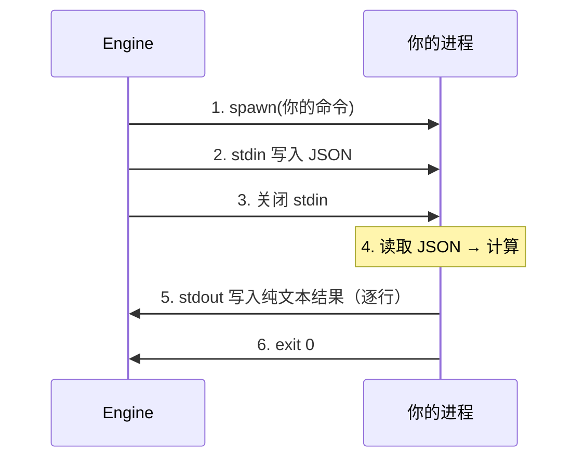

# Nexus Node Protocol

> 节点是 Nexus 工作流引擎中的计算单元。
> 你只需要实现一个接收 JSON 输入、输出纯文本的独立进程。
> 不需要了解引擎内部机制。
>
> **注意**：v1 只支持纯文本输出（UTF-8 编码）。二进制数据（图片、序列化对象等）需自行 base64 编码。

---

## 一、一句话概括



---

## 二、输入格式（stdin）

引擎向你写入一个 JSON 对象：

```json
{
  "inputs": {
    "source_node_id": "上游节点输出的字符串"
  },
  "extensions": {
    "model": "anthropic/claude-sonnet-4",
    "prompt": "请 review 这段代码..."
  }
}
```

| 字段 | 类型 | 说明 |
|------|------|------|
| `inputs` | `object` | 上游节点的输出。key = 来源节点 ID，value = 该节点输出的纯文本。如果你不需要上游数据，这里可能是 `{}` |
| `extensions` | `object` | 节点类型特有的配置参数。不同的节点类型有不同的扩展字段，由具体节点自行定义。如果需要分支路由，`extensions` 中会包含 `returns` 数组，列出你可以返回的值 |

---

## 三、输出格式（stdout）

向 stdout 写入你的计算结果。**纯文本，不需要 JSON 包装。**

引擎会**逐行实时读取** stdout，每行到达即触发 `nexus::node::chunk` 事件。
节点不需要等进程退出——中间结果在运行时就可被引擎感知。

### 普通输出

不需要特殊前缀，直接输出纯文本——每行在运行时实时上报，进程退出后汇总为完整输出：

```
代码评审结果：
1. 风格良好
2. 建议添加类型注解
```

### 流式事件（实时上报，不占输出）

行前缀 `__nexus_event:` 表示一个结构化输出片段。适合通知引擎进度或中间结果：

```
__nexus_event: 进度 2/5
__nexus_event: tool_use 分析代码结构
```

引擎收到 `__nexus_event:` 行后：
1. 通过 `nexus::node::event` tracing 事件实时记录
2. 追加到业务输出缓冲区（最终作为 `NodeOutcome::output` 的一部分传递下游）

### 中间日志（不占输出）

行前缀 `__nexus_log:` 表示仅用于日志、不进入业务输出的信息：

```
__nexus_log: 开始处理文件 main.ts
__nexus_log: API 请求耗时 3.2s
```

### 分支路由（exit_reason）

行前缀 `__nexus_exit_reason:` 设置分支路由的返回值。NodeShell 提取该值作为 exit_reason，**不需要等进程退出**：

```
__nexus_exit_reason: approved
业务输出内容...
```

引擎收到 `__nexus_exit_reason:` 时立即记录 exit_reason，剩余 stdout 内容作为业务输出传给下游。

### 取消前缀模式

如果你输出的内容恰好以 `__nexus_` 开头而又不想被当作协议前缀处理，可以发一行 `__nexus_log_end`，之后的所有行不再检查前缀：

```
__nexus_log_end
__nexus_exit_reason: 这行不会被解析为 exit_reason
__nexus_log: 这行也不会被解析为 log
```

---

## 四、退出码

| 退出码 | 含义 | 引擎行为 |
|--------|------|---------|
| 0 | 正常完成 | 引擎采用 stdout 内容作为节点的输出 |
| 非 0 | 节点自己报告异常 | 引擎记录退出码，走失败处理路径 |
| 进程被信号杀死 | 异常终止 | 引擎记录信号编号，走失败处理路径 |

**"异常"也是节点的结果。** 引擎不判断 exit code 好不好——它只是记录。

---

## 五、exit_reason（返回值）

如果你需要分支路由（不同的结果走不同的下游），可以在退出前设置 `exit_reason`：

```
extensions.returns = ["approved", "rejected"]   ← 引擎传给你的可选值
exit_reason = "approved"                         ← 你选一个返回
exit 0
```

引擎不关心你如何决定 exit_reason——你来算，你来填。不设置 exit_reason 则引擎按事件类型默认路由。

exit_reason 可以通过两种方式设置：
1. stdout 首行写 `__nexus_exit_reason: <value>`（运行时实时设置）
2. 通过进程退出码和节点返回值逻辑（引擎侧支持，不需要显式设置）

完整流程：

```
1. 读 stdin → 拿到 inputs 和 extensions（含 returns）
2. 计算 → 输出结果到 stdout（纯文本）
3. 在 stdout 中通过 __nexus_exit_reason: 设置退出原因（可选）
4. exit 0
```

---

## 五、stderr

日志输出到 stderr。引擎会收集但不解析。
**不要污染 stdout**——stdout 只放计算结果。

---

## 六、完整示例

### Python

```python
import sys
import json

def main():
    ctx = json.load(sys.stdin)
    inputs = ctx.get("inputs", {})
    extensions = ctx.get("extensions", {})

    # 实时报告进度
    print("__nexus_event: 开始处理...")
    
    # 你的业务逻辑
    result = do_something(inputs, extensions)

    # 设置分支路由（可选）
    print("__nexus_exit_reason: completed")
    
    # 输出纯文本结果
    print(result)

if __name__ == "__main__":
    main()
```

### Node.js

```javascript
const chunks = [];
process.stdin.on('data', c => chunks.push(c));
process.stdin.on('end', () => {
    const ctx = JSON.parse(chunks.join(''));
    const result = compute(ctx.inputs, ctx.extensions);
    console.log(result);
});
```

### Rust

```rust
use std::io::{self, Read};
use serde::Deserialize;

#[derive(Deserialize)]
struct NodeContext {
    inputs: std::collections::HashMap<String, String>,
    #[serde(default)]
    extensions: std::collections::HashMap<String, String>,
}

fn main() -> io::Result<()> {
    let mut input = String::new();
    io::stdin().read_to_string(&mut input)?;
    let ctx: NodeContext = serde_json::from_str(&input)
        .map_err(|e| io::Error::new(io::ErrorKind::InvalidData, e))?;
    let result = compute(ctx.inputs, ctx.extensions);
    println!("{}", result);
    Ok(())
}
```

---

## 七、你需要知道的事

| 你不需要关心 | 引擎和 NodeShell 会处理 |
|-------------|----------------------|
| 超时 | 引擎会强杀超时进程，你不需要处理超时 |
| 重试 | 引擎自己决定是否重新启动你的进程 |
| 第几次调用 | 每次调用你的进程都是独立启动 |
| 并发 | 引擎管理并发，同一时间可能有多份你的进程在跑 |
| 数据来源 | 引擎只会把你在工作流定义中声明的数据传进来 |
| exit_reason 提取 | 按 `__nexus_exit_reason: <value>` 格式写 stdout 即可，引擎实时提取 |
| 流式输出 | stdout 每行实时上报，不需要等进程退出 |

---

## 八、扩展：通过协议接入外部工具

> **不需要改引擎代码。** 任何可以通过 stdin/stdout 交互的程序都可以成为 Nexus 节点。

所有工具统一通过 `type: "subprocess"` 接入。不需要专门的包装脚本或 AI executor。

### OpenCode

```bash
nexus-cli run workflows\opencode-example.json
```

工作流配置示例（单节点，直接调用 opencode）：

```json
{
  "nodes": [{
    "id": "code_review",
    "providers": [{
      "type": "subprocess",
      "command": "opencode run --format json --dangerously-skip-permissions -- \"检查代码中的 bug\""
    }],
    "process_timeout_secs": 300
  }]
}
```

### Claude Code

```json
{
  "type": "subprocess",
  "command": "claude -p \"{{inputs.prompt}}\" --output-format json --model claude-sonnet-4"
}
```

### 链式传递（模板插值）

上游节点输出通过 `{{inputs.node_id}}` 模板语法注入到子进程命令中：

```json
{
  "id": "review",
  "providers": [{
    "type": "subprocess",
    "command": "opencode run --format json -- \"{{inputs.config}}\""
  }],
  "inputs": ["config"]
}
```

### 其他工具

| 工具 | 包装方式 |
|------|---------|
| ESLint | `npx eslint --format json src/` |
| pytest | `pytest --json-report` |
| 任何脚本 | 按 NODE_PROTOCOL 实现 |

---

## 十、检查清单

| # | 检查项 | ✅ |
|---|--------|---|
| 1 | stdin 读的是 JSON 对象，不是字符串或数组 | □ |
| 2 | stdout 输出**纯文本**，没有多余的 JSON 包装 | □ |
| 3 | 正常情况 exit 0 | □ |
| 4 | 日志全部写到 stderr，不污染 stdout | □ |
| 5 | 退出前释放所有外部资源（文件、网络连接等） | □ |
| 6 | 程序能正确处理空 `inputs` 和空 `extensions` | □ |
| 7 | 如果启用分支路由，exit_reason 是 `returns` 中的合法值 | □ |
| 8 | 需要实时上报进度时，用 `__nexus_event:` 前缀 | □ |
