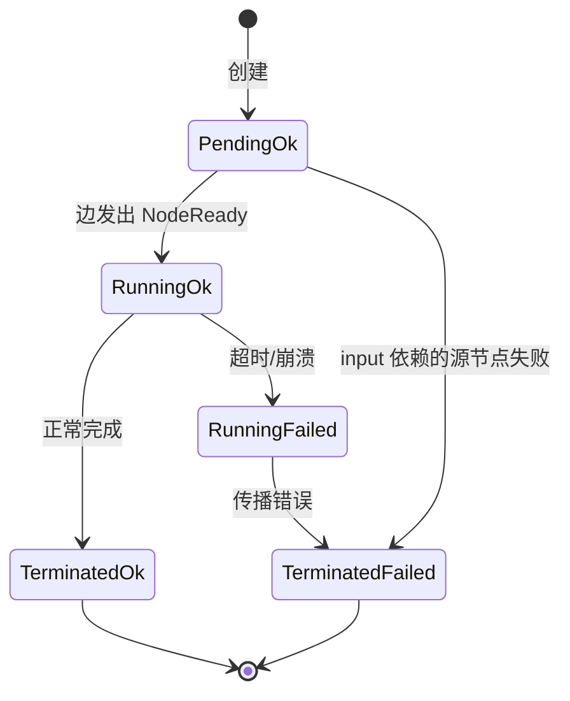
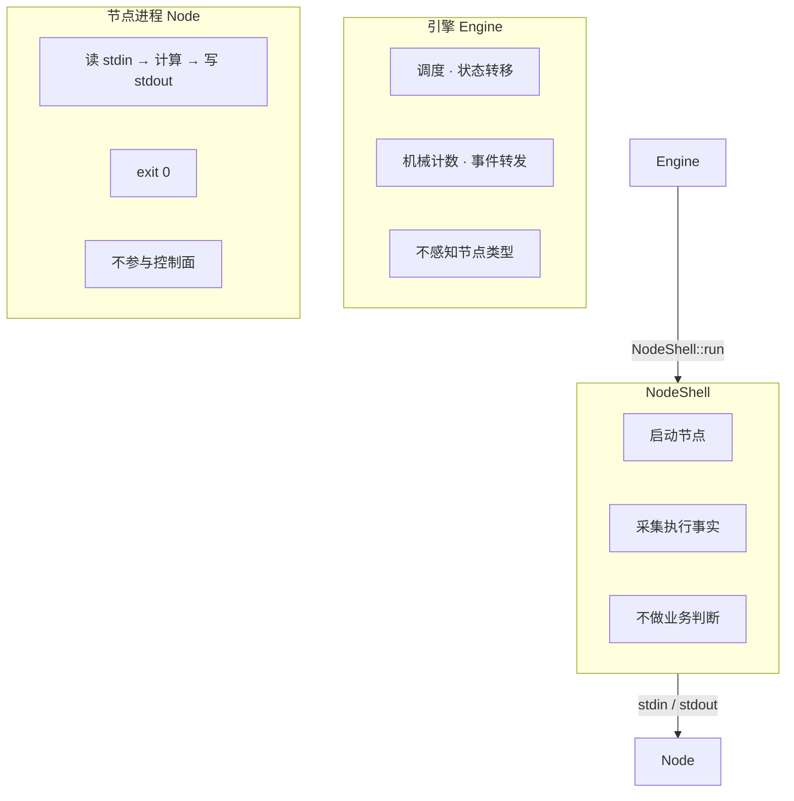

# Nexus 设计哲学

> **全局 = 局部信息的迭代闭包。引擎不是控制器，是闭包求值器。**

---

## 〇、核心命题

**命题（局部闭包定理）：**  
对于任意有限有向图 G = (V, E)，若每个顶点 v ∈ V 附带一个局部转移函数 f_v : State_v → 2^V（将 v 的局部状态映射到需要触发的下游顶点集），则全局执行轨迹 T(G) 等价于所有 f_v 在状态空间上的最小不动点。

### 转移函数的完整形式

```
F_v(C_v, e, r, O_v, S) = { t_i | for each e_i ∈ O_v:

  (1)  S[i].triggered == false                     - 边未被触发过
  (2)  e_i.event_type == e                           - 事件类型匹配
  (3)  e_i.exit_reason == None ∨ e_i.exit_reason == r - 返回值匹配
  (4)  e_i.strategy == Any ∨ (e_i.strategy == All
            ∧ S[i].received ⊇ e_i.from_nodes)         - 覆盖面条件
  (5)  S[i].event_count + 1 ≥ e_i.threshold          - 达到阈值

  ⇒ 触发下游 t_i = e_i.to
}
```

| 符号 | 含义 | 来源 | 类型 |
|------|------|------|------|
| `v` | 当前完成的节点 | 执行引擎 | `NodeIndex` |
| `C_v` | 节点 v 的计数器：各事件类型已发生的次数 | 引擎维护 | `{ complete, failed, timeout }: u64` |
| `e` | 本次事件类型（Complete / Failed / Timeout） | 引擎从执行事实推导 | `EventType` |
| `r` | 本次的返回值（exit_reason） | NodeShell 采集 | `Option<String>` |
| `O_v` | 节点 v 的出边集合 | Builder 构建 | `{ from_nodes, to, event_type, exit_reason, threshold, strategy }` |
| `S` | 所有边的运行时状态集合 | Scheduler 维护 | `{ event_count, triggered, received }[]` |
| `{ t_i }` | 本次应触发的下游节点集合 | F_v 的输出 | `Vec<NodeIndex>` |

**收敛条件（不动点）：**

当所有 Running 状态的节点执行完毕、就绪队列为空时，所有 f_v 达到不动点，引擎停止。此时全局执行轨迹等价于中心化调度下的预期路径。

```
is_done = (running_count == 0) && ready_queue.is_empty()
```

引擎不需要知道全局图——它只追踪两个信号：还有节点在跑吗？还有节点排队吗？都为空，则工作流已收敛。

### 命题推论

**推论 1（等价性）：** 全局执行轨迹 T(G) = 局部转移函数 f_v 的迭代闭包。不需要中心化控制器——引擎是闭包求值器，不是流程管理器。（→ 原则 6）

**推论 2（终止性）：** 当所有 Running 状态的节点执行完毕、就绪队列为空时，所有 f_v 达到不动点，引擎收敛。收敛时，执行轨迹等价于中心化调度下的预期路径。引擎不需要知道全局图——只需要追踪 `running_count == 0 && ready_queue.is_empty()`。（→ 原则 4）

**推论 3（完备性）：** All（∧）和 Any（∨）可以表达任意布尔触发逻辑。不需要第五种边维度。（→ 原则 4）

### 形式化定义

**All 边（合取）：**

```
边 e = (S, t, T, All)，S = {s₁, ..., sₙ} 为上游节点集合，t 为下游节点，T 为阈值
令 R(t) = { s ∈ S | s 已至少产生一次匹配事件 }

e 在时刻 t 触发的条件：
  R(t) = S                    ← 所有上游至少参与一次（覆盖条件）
  ∧ Σ_{s∈S} event_count(s) ≥ T  ← 所有上游事件总数达到阈值

触发后：t 进入就绪队列，e.triggered = true
```

**Any 边（析取）：**

```
边 e = (S, t, T, Any)，S = {s₁, ..., sₙ} 为上游节点集合，t 为下游节点，T 为阈值
令 total = Σ_{s∈S} event_count(s)

e 在时刻 t 触发的条件：
  total ≥ T                   ← 不要求覆盖条件，任何上游的事件都计入

触发后：t 进入就绪队列，e.triggered = true
```

All 与 Any 的区别仅在于**覆盖条件**：All 要求每个上游至少参与一次后才开始累计，Any 不需要此条件。触发后的行为相同。

三个结论的成立条件不同：等价性依赖实现与 F_v 定义的一致，终止性依赖阈值的有界配置，完备性已在 All/Any 证明中给出。三者一起构成了整个架构的数学根基。

### 人话翻译

整个工作流没有一个中心化的"流程控制器"在告诉节点"你该做什么、下一步去哪"。每个节点只带两个东西——自己的执行计数器和出边规则。引擎做的事就是反复问每个节点"你的条件满足了吗？满足就触发你的下游"。反复问到所有人都说"不满足了"的时候，结果就是整个工作流的执行结果。

所以 Nexus 不是"引擎在控制流程"，而是"节点自己决定何时触发谁"。引擎只是一个闭包求值器：不断应用 F_v，直到系统收敛。

---

### 声明完备性原则

> **引擎不弥补声明的缺口。**

工作流的行为边界完全由声明（JSON 配置）定义。如果运行时产生了声明未覆盖的情况——这不是引擎的职责范围。

```
声明面（JSON）：returns = ["approved", "rejected"]
行为面（运行时）：exit_reason = "pending"

→ 声明不完备。
```

**推论：**
- Validator 检查声明完备性，但只发 Warning——因为声明不完备不一定是运行时错误（业务场景可能永远不会触发未覆盖的路径）
- 运行时遇到声明未覆盖的 exit_reason → 引擎记录 warning 日志并跳过不匹配的出边，不崩溃退出
- 引擎不需要兜底、不需要容错、不需要未定义行为的保护机制

> **为什么不崩溃？** 字符串类型的 exit_reason 值域是无限的（与 C 的 enum 不同）。Validator 可以检查"所有出边的 exit_reason 都在 returns 中"，但**无法**检查"所有可能的运行时 exit_reason 都在 returns 中"。节点可能因为一个尾随空格（`"approved "` vs `"approved"`）而触发未覆盖路径。在无限值域面前，崩溃不能解决完备性问题——可诊断的日志和清晰的错误报告比不可恢复的崩溃更有实际价值。

如果用户不希望声明不完备——补全声明，也可以使用 Validator 的 Warning 检查来辅助排查。

---

### 执行模型等价性定理

**问题**：Nexus 采用去中心化的异步事件驱动模型——引擎不扫描全局图，只被动响应 `NodeCompleted` 事件，调用已完成节点 v 的局部转移函数 F_v。这个模型和一个假设的"中心化同步调度器"模型会产生相同的路径集和终态吗？

**结论**：会。两者使用完全相同的转移函数，在每一步的状态转移上保持一致。

---

#### 一、形式化基础

**转移函数的不含时性**：F_v 的完整形式（§0）的输入变量为：

```
C_v（节点计数器）, e（事件类型）, r（exit_reason）, O_v（出边定义）, S（边状态）
```

所有变量均为系统的**静态或运行时状态变量**。F_v 的签名中**不存在时间变量**——不读系统时钟、不记调用序号、不依赖任何与物理时间或事件到达时序相关的量。F_v 的判定结果仅由当前状态和当前事件决定。这是 §0 转移函数定义本身蕴含的结论，不是额外假设。

**核心观察**：F_v 是一个定义在状态空间上的马尔可夫转移核。模型的全部状态演化由初始状态和事件序列唯一确定，与"谁来调用 F_v"无关。

---

#### 二、前提条件

**P1 — 转移核同一性（Kernel Identity）**  
两个模型共享完全相同的转移核：同一组转移函数 {F_v | v ∈ V}，作用于同一个底层结构。其中图 G = (V, E) 为有限有向图，每条边 e_i ∈ E 携带四个正交维度的元数据。两个模型对 F_v 的访问语义一致：都能且只能通过 O_v（v 的出边索引集）定位 F_v 的判定范围，都不能读写非 O_v 的边状态。

> *工程对应：两个模型基于同一个 Builder 的输出运行——同一份 WorkflowDef、同一组边定义 E、同一组 NodeTransfer 索引 {O_v}、同一份边状态初始值。默认自环边在 Builder 阶段已纳入 E。入口节点集 V₀ 由 Builder 按同一个规则（前驱为空）识别。*

**P2 — 初始状态齐一性（Initial State Alignment）**  
两个模型从完全相同的初始配置 (S₀, C₀, Q₀) 开始。其中：
- S₀ 中所有 s_i = (triggered = false, event_count = 0, received = ∅)
- C₀ 中所有 c_v = (0, 0, 0)
- Q₀ 包含完全相同的初始待调度节点集合（即入口节点集 V₀），消费顺序一致（FIFO）

> *工程对应：初始化阶段，两个模型对入口节点的识别和入列行为完全一致。*

**P3 — 转移函数的确定性（Determinism of F_v）**  
F_v 是纯函数：相同的输入 (s_i, e_i, e, r, v) 总是产生相同的输出。不依赖随机数、系统时钟或外部 I/O。

> *工程对应：can_trigger 的判定路径仅由整数比较、字符串匹配、集合包含测试和数值比较构成——不含分支外的非确定性。*

---

#### 三、模型定义

两类模型运行于同一标架之上，共享完全相同的底层结构。

**共享数据结构**：

```
E = {e₁, ..., e_m}   边定义集
S = {s₁, ..., s_m}   边状态集，s_i = (triggered_i, event_count_i, received_i ⊆ V)
C = {c₁, ..., c_n}   节点计数器集，c_v = (complete_v, failed_v, timeout_v) ∈ ℕ³
O_v ⊆ {1..m}         v 的出边索引集，O_v = {i | e_i 以 v 为出边源节点}
Q                    就绪队列（先进先出，元素类型 V）
```

**模型 D（去中心化·异步）**——Nexus 的实际执行模型：

```
on_event(v, e, r):
  C_v[e] ← C_v[e] + 1
  for each i ∈ O_v:
    if ¬s_i.triggered ∧ s_i.event_type = e ∧ match_exit(s_i, r):
      if s_i.strategy = All:
        s_i.received ← s_i.received ∪ {v}
        if |s_i.received| < |s_i.from_nodes|:  continue
      s_i.event_count ← s_i.event_count + 1
      if s_i.event_count ≥ s_i.threshold ∧ ¬s_i.triggered:
        s_i.triggered ← true
        Q.push(s_i.to)
```

**模型 C（中心化·同步）**——假设的对照模型：

与 D 的差异仅在于"谁触发 on_event"这个程序层面的控制流来源。C 在被调用时执行与 D **逐行相同的算法**：同样的条件分支、同样的状态更新、同样的入队操作。

**两模型的关系**：D 和 C 实现的是同一个算法 A：A(S, C, Q, v, e, r) → (S', C', Q')。这个算法只依赖它的参数——且这些参数均不含时间。因此，对 A 的两次调用给定相同的 (S, C, Q, v, e, r)，必然产生相同的 (S', C', Q')。

---

#### 四、定理与证明

**定理（执行模型等价性）**：  
令 Φ 为满足 P1 的底层系统。令模型 D 和 C 从满足 P2 的初始状态启动。假设 F_v 满足 P3。则对于任意次状态转移，两模型在每一步后保持完全状态一致。

```
S_D(k) = S_C(k),   C_D(k) = C_C(k),   Q_D(k) = Q_C(k)   对任意 k ≥ 0
```

**证明**：对引擎处理的事件个数 k 进行归纳。

*基例 k = 0*：无事件发生，两模型保持初始状态。由 P2 直接得相等。

*归纳假设*：前 k 个事件处理后，两模型状态完全一致。

*归纳步骤*：当前状态为 (S(k), C(k), Q(k))，两模型相同。

**(a) 事件来源的一致性**：Q 非空时，两模型从各自 Q 中出队下一个待执行节点。由归纳假设 Q_D(k) = Q_C(k)，出队的节点 v 相同。该节点执行完毕后产生事件 σ_{k+1} = NodeCompleted(v, e, r)。由于节点执行层相同（P1），两模型产生的事件相同。

**(b) 状态转移的一致性**：两模型收到 σ_{k+1} 后均调用 on_event(v, e, r)，执行相同的算法 A_edge，遍历相同的 O_v（P1）。由 P3 保证确定性、由 F_v 的不含时性保证结果不依赖时序。对 i ∈ O_v，每一步分支判定相同，状态更新相同。对 i ∉ O_v，均不访问，状态不变。

因此边状态更新结果相同：S_D(k+1) = S_C(k+1)。

**(c) 节点计数器和就绪队列的一致性**：节点计数器更新相同（均执行 C_v[e]+=1），就绪队列更新相同（被触发的下游节点集相同、入队顺序相同）。

故 C_D(k+1) = C_C(k+1)，Q_D(k+1) = Q_C(k+1)。

三部分之和：状态完全一致。归纳完成。∎

**关于收敛的说明**：上述归纳证明了两个模型在每一步后的状态完全相同。因此，当其中一个模型满足收敛条件（|Running| = 0 ∧ Q = ∅）时，另一个必然同时满足。引擎收敛时终态相同。

**关于单调性的说明**：F_v 的边状态更新在实际实现中是单调的（triggered 只从 false 变 true，event_count 只递增，received 只插入），但单调性对等价性证明不是必需的。即使 F_v 可以复位边状态（例如自环边场景中复位 triggered 以实现多次重试），只要 D 和 C 使用同一个（可复位的）F_v，等价性仍然保持。单调性真正保证的是系统必然收敛——这属于 §0 终止性论证的范畴。

---

#### 五、推论

**推论 1（路径等价性）**：两模型产生的 `NodeReady` 序列完全相同。触发执行路径（哪个节点在哪个事件后触发）在两模型下一致。

**推论 2（收敛等价性）**：引擎收敛时两模型的终态相同。"|Running| = 0 ∧ Q = ∅" 的判别逐时刻同真同假。

**推论 3（确定性）**：给定相同的图拓扑和初始状态，引擎的执行路径由事件序列唯一确定——不因调用方是谁而改变。

---

#### 六、辅助理解

##### 为什么等价性几乎是不证自明的？

D 和 C 共享完全相同的转移函数、完全相同的初始状态、完全相同的图定义。两者的区别仅仅是"谁调了 on_event"这个程序层面的细节。如果同一个数学函数在同一个输入下会产生不同输出，那它就不是一个数学函数。

##### 前提的作用

| 前提 | 防止的问题 | 具体场景 |
|------|-----------|---------|
| P1 | 图不同 | Builder 给 D 和 C 生成了不同的边定义或 O_v |
| P2 | 起点不同 | 两模型对入口节点的识别规则不一致 |
| P3 | 非确定性转移 | F_v 中出现了随机数或外部 API 调用 |

这三个前提中，P2 和 P3 是"如果被违反，一切数学论证都失效"的平凡条件。P1 是唯一一个"架构选择直接映射为数学条件"的前提——它要求 Builder 在构建阶段输出确定且一致的图结构。

##### 这个定理回答了什么问题

**"去中心化会不会漏掉某些触发？"**  
不会。两模型使用完全相同的判定逻辑，执行的代码路径同构。不漏。

**"事件到达的乱序会不会影响路径？"**  
不会。转移函数 `F_v` 的输入变量（§0）中**不存在时间变量**——不读系统时钟、不记调用序号、不依赖事件到达时序。F_v 的判定结果仅由当前状态和当前事件决定，不因"谁先被处理"而改变。对于出边互不相交的两个节点，交换它们的处理顺序不改变最终状态；对于共享同一出边的节点（如 All 边），F_v 需要等待所有上游到齐后才触发，谁先到无所谓。

**"这个证明是否 trivial？"**  
在某种意义上是的——这正是要点。D 和 C 共享同一个 F_v，它们的差异仅在架构层面而非计算层面。证明的简洁性本身就是架构正确性的信号。

---

## 命题推论：All / Any 是完备的条件组合原语

**主张：** 任意布尔逻辑表达式（由 `∧`、`∨` 组合的上游触发条件）都可以用 All 和 Any 两种边在图上等价表达。

**证明思路：** All 对应合取（`∧`），Any 对应析取（`∨`）。通过引入辅助节点，任意嵌套的 `∧` / `∨` 表达式可以展开为两层 All/Any 边的图结构。

**引理 1（All = ∧）：**
一组上游 `{A, B}` 的 All 边等价于"A 完成 ∧ B 完成"。

```
A ──All──→ D   ≡   D 就绪当且仅当 A 完成且 B 完成
B ──All──→ D
```

**引理 2（Any = ∨）：**
一组上游 `{A, B}` 的 Any 边等价于"A 完成 ∨ B 完成"。

```
A ──Any──→ D   ≡   D 就绪当且仅当 A 完成或 B 完成
B ──Any──→ D
```

**定理（完备性）：** 对于任意由 `∧` 和 `∨` 构成的布尔触发表达式 T，存在一个图 G 使得 G 的执行语义等价于 T。

*证明（构造法，对表达式深度归纳）：*

*基例：* 单个变量 A → 以 A 为唯一前驱的 All 边（或 Any 边，等价）即可，无需证明。

*归纳步骤：*

**情况 1 — T = T₁ ∧ T₂**（合取）

设 G₁ 是 T₁ 的图实现，以节点 X 输出"T₁ 满足"信号。
设 G₂ 是 T₂ 的图实现，以节点 Y 输出"T₂ 满足"信号。

构造一个新的中间节点 M（空操作节点，仅用于聚合信号），连接：

```
X ──All──→ M
Y ──All──→ M
M ──Any──→ D（threshold=1）
```

当且仅当 X 和 Y 都产生信号后，M 收到 All 触发，然后立即转发给 D。这与 T₁ ∧ T₂ 的语义一致。

**情况 2 — T = T₁ ∨ T₂**（析取）

同样构造 M：

```
X ──Any──→ M
Y ──Any──→ M
M ──Any──→ D（threshold=1）
```

X 或 Y 任一产生信号，M 立即收到 Any 触发，转发给 D。这与 T₁ ∨ T₂ 的语义一致。

**推论：** All 和 Any 作为条件组合原语是完备的——任何由 `∧` / `∨` 表达的上游触发逻辑都可以通过有限层级的 All/Any 边和中间节点在图拓扑中等价实现。

**工程意义：** 引擎不需要理解 `∧` 和 `∨`——它只需要 All 和 Any。更复杂的组合逻辑通过图的拓扑结构表达，不通过边类型的扩展。边的四种正交维度（事件类型、返回值、组合逻辑、阈值）不需要增加第五种维度。

---

## 〇·五、为什么不用中心化方案？

去中心化的闭包求值器不是唯一选择。大多数工作流引擎采用**中心化调度器**（一个"流程经理"知道全局拓扑，在每个节点完成时决定"接下来谁跑"）。两种方案各有取舍。

### 中心化的优势 — 也就是去中心化的代价

| 优势 | 说明 | 去中心化如何弥补 |
|------|------|----------------|
| **全局可见性** | 调度器知道整个图剩余工作、瓶颈在哪 | 外围分析器做静态估算 |
| **全局动态决策** | "整体超时就跳过"——调度器直接改指针 | 加全局超时切刀组件 |
| **debug 直观** | "A 完了→调度器决定去 B"——单一 trace | 做好 tracing 工具 |
| **与人的心智对齐** | 人思考流程时自然用"先 A 再 B"的中心叙述 | Builder 层提供 DSL 做视觉映射 |
| **动态拓扑** | 运行时加/删节点，调度器直接改指向 | Builder 做版本快照+停机切换 |
| **编译期优化** | 调度器预分析慢路径、热点路径，预调度资源 | 可加外围 PGO 分析器 |

### 去中心化的优势 — 也就是中心化的代价

| 优势 | 说明 | 中心化为何做不到 |
|------|------|----------------|
| **状态空间不膨胀** | 复杂度 = O(边数)，不随"模式数量"增长 | 调度器的 if-else 结构随支持的流程模式数 **乘性增长** |
| **新功能不耦合** | 新增事件类型 = 新增一种边的实现，引擎主循环不动 | 新增功能必须改 Scheduler::get_next()——**调度器成为所有特性的耦合点** |
| **测试矩阵有限** | 边测试 = 事件×返回值×组合×阈值的四维笛卡尔积，且正交 | 调度器测试 = 所有事件×所有节点×所有状态的组合，每加特性翻倍 |
| **无竞态条件** | 每条边状态只被 handle_event 独占修改 | 并发节点同时完成时，消息处理顺序可能改变行为 |
| **无单点失效** | 没有"调度器逻辑"模块——大脑分布在所有边上 | 调度器挂了整个工作流卡死 |
| **分布式友好** | 边状态可以和节点状态一起分片，不需要全局共识 | 中心调度器天然是单节点，扩展到多机要解决共识问题 |
| **插件引擎天然匹配** | 插件决定返回值→边决定触发谁→引擎只做机械转发 | 引擎做业务判断，和"插件引擎"理念冲突 |

### 根本差异

```
中心化调度器                    去中心化闭包求值器
─────────────────              ────────────────────
大脑 = 一个模块                大脑 = 分布在所有边上
复杂度 O(模式 × 事件)          复杂度 O(边)
新增功能 = 改调度器            新增功能 = 新增边类型
测试 = 状态组合乘表            测试 = 四个维度笛卡尔积（固定）
竞态 = 看消息顺序             竞态 = 不存在（单源修改）
分布式 = 共识问题              分布式 = 边状态可随节点分片
人话直观 = ✅                 人话直观 = ❌ 需理解"闭包求值"
```

### 什么时候中心化反而是对的？

如果工作流总模式 ≤ 5 种、图规模固定、不需要第三方写插件、调试可见性压倒扩展性——中心化更合适。但 Nexus 的目标是一个**插件编排引擎**，它无法预知插件作者会写出什么 `exit_reason`、什么图拓扑。一个"什么都不知道"的引擎，是唯一能保证"不管插件怎么折腾都不崩"的方式。

**结论：去中心化让引擎变得**简单但抽象**；中心化让引擎变得**复杂但直观**。Nexus 选择了前者，因为对插件引擎来说，"引擎不崩溃"和"扩展不需要改引擎"压倒"一目了然"。

---

## 一、一句话说清

Nexus 是一个 **有向图驱动的插件编排引擎**。但它没有中心化的流程控制器——每个节点只带自己的计数器和出边规则，引擎反复问每个节点"你的条件满足了吗"，直到所有人都说"不满足了"。

---

## 二、六个设计原则

六个原则不是独立的好主意——它们是从命题的三重含义（§0）推演出的工程选择。每个原则解决命题某个结论在工程实现中暴露的具体问题：

| 原则 | 依赖的命题结论 | 解决的问题 |
|------|--------------|-----------|
| 1. Syntax/Semantics 分离 | 等价性 | 保证引擎实现与 F_v 定义一致，不引入隐式语义 |
| 2. 状态×结果正交分解 | 等价性 | 精确定义"一次迭代"的起止边界，避免状态溢出 |
| 3. 引擎触发 vs 任务触发 | 等价性 | 界定引擎该知道的和不该知道的，维持 f_v 的局部性 |
| 4. 边的四维正交模型 | 终止性 + 完备性 | 阈值保证收敛，All/Any 保证表达力，四种维度保证充分且无冗余 |
| 5. 边和节点都是一等公民 | 完备性 | 新增行为 = 新增边类型，不需要改已有模块 |
| 6. 引擎是执行环境，不是控制器 | 等价性 | 引擎只做机械计数和转发，不做业务判断 |
| 7. 事件驱动解耦 | 等价性 | 保证 f_v 的独立性——每个边不依赖其他边的判定结果 |

### 原则 1：Syntax / Semantics 分离

```
语法层（Graph Engine）                   语义层（Runtime Engine）
─────────────────                       ────────────────────
Builder + Validator                     Event Loop + Scheduler + Executor + Edge + DataRouter
检查：连通性、可达性、配置合法性          执行：事件驱动、调度、进程管理
```

好处：
- 语法层测试不需要 mock 进程
- 语义层测试不需要重新解析图
- 错误尽早暴露（解析时而非运行时）

### 原则 2：状态 × 结果正交分解

节点状态不是一维枚举，而是两个正交轴的笛卡尔积：

```
                Status
          Pending  Running  Terminated
     Ok      ✅       ✅        ✅
Outcome
   Failed    ❌       ✅        ✅
```

实际有效的只有 7 条转移路径：



**7 条路径 = 完备极小值**。任何更少的状态都无法覆盖所有合法行为。

### 原则 3：引擎触发 vs 任务触发

触发下游节点的原因分两类：

| 触发类型 | 来源 | 引擎是否理解内容 |
|---------|------|----------------|
| **引擎触发** | 节点执行事实：exit_code、timed_out、spawn 成功/失败 | 不需要——引擎只读退出码和超时标记 |
| **任务触发** | 节点输出内容：stdout 中包含特定关键字 | **引擎不理解**——由节点返回值处理 |

每个节点可以预定义一组返回值（`returns`），节点运行完后填入一个值。引擎根据返回值选择走哪条出边：

```
JSON 配置（仅示意核心字段，edges 和 dataflows 在顶层声明）：
{
  "id": "review_node",
  "returns": ["approved", "rejected"]
}
```

节点 stdout 写业务数据，exit_reason 写返回值——引擎不解读 exit_reason 的含义，只做字符串匹配：

```
节点完成 →
  event = Complete
  exit_reason = "approved"       ← 节点自己填的

  遍历出边：
    Complete/exit_reason="approved"  → merge_node
    Complete/exit_reason="rejected"  → fix_node
    Timeout                          → notify_node
    Failed                           → error_node
```

如果节点不需要分支，`returns` 配置为空，引擎忽略 exit_reason。

### 原则 4：边 = 事件类型 × 返回值 × 组合逻辑 × 阈值

每条边由四个正交维度定义：

| 维度 | 取值 | 引擎是否理解含义 |
|------|------|----------------|
| **事件类型** | Complete / Failed / Timeout | 是——执行事实 |
| **返回值** | `exit_reason: Option<String>` | **否**——纯字符串匹配 |
| **组合逻辑** | All / Any | 是——数学逻辑 |
| **阈值** | `threshold: u64` | 是——整数比较 |

`threshold: 1` 表示事件发生一次就触发下游（默认行为）。`threshold: N` 表示事件发生 N 次后才触发下游。

对于 All 边：所有上游至少参与一次后，才开始累计事件次数。Any 边：任何上游的事件都直接计入次数。

这个设计统一了以下概念：

| 旧概念 | 统一为 |
|--------|-------|
| `max_iterations` | Complete 边的 `threshold` |
| `exit_patterns` | 不需要，由 `exit_reason` 替代 |
| `should_reenter` / `decide_iteration` | 不需要——引擎三种事件对称处理 |
| 重试 | Scheduler 独立计数（默认 3 次，用户可配置） |
| 分支节点 | 不需要——每个节点通过 `exit_reason` 自行路由 |

阈值的存在保证了环的终止。Validator 在编译期检查每个 SCC（强连通分量——图中最大的环结构）：只要环内至少有一个节点配置了 threshold > 1 的边、或有分支出边离开环，环就是可收敛的。否则报错。

### 原则 5：调度拓扑 ≠ 数据拓扑

工作流中有两张独立的图：

| 图 | 声明位置 | 含义 | 由谁处理 |
|---|---------|------|---------|
| **调度拓扑** | `edges[]` | 谁完成后谁可以开始 | Scheduler + 边判定 |
| **数据拓扑** | `dataflows[]` | 谁的数据传给谁 | DataRouter 组装 |

```
edges[]:
  A ──Complete──→ B     ← B 在 A 完成后触发
  A ──Complete──→ C     ← C 在 A 完成后触发

dataflows[]:
  A ──output──→ C       ← C 接收 A 的输出
  B ──output──→ C       ← C 也接收 B 的输出
```

节点 C 在 A 完成后触发（调度拓扑决定），但它的输入同时来自 A 和 B（数据拓扑决定）。B 可能在 C 之后才执行——DataRouter 返回 B 的上一次输出（snapshot semantics）。两个拓扑互不依赖。

**推论：**
- 节点可以接收任意节点的输出，无论它是不是前驱
- DataRouter 不关心调度顺序，只做存储和转发
- 删去了 `NodeDef.inputs`——数据路由关系由全局的 `dataflows[]` 统一声明，不再附着在节点定义中

### 原则 6：边和节点都是图的一等公民

图由两种基本元素构成，每种拥有自己的信息，各自独立决策：

| 图元素 | 拥有信息 | 决策 |
|--------|---------|------|
| **节点** | 计算逻辑、输入输出、返回值定义 | 产生什么数据、返回什么结果 |
| **边** | 事件类型、返回值匹配、组合逻辑、阈值 | 何时、以什么条件通知下游 |

新增事件类型或组合逻辑 = 新增一种边的实现。不需要改 Scheduler，不需要改 Event Loop。

### 原则 6：引擎是执行环境，不是控制器

引擎收到节点完成后，只做三件事，没有例外：

```
节点执行完毕 → 确定事件类型
                  │
                  ├── exit_code = 0   → Complete
                  ├── timed_out       → Timeout
                  └── exit_code ≠ 0   → Failed
                      │
                      ▼
                  counters[node][event]++
                      │
                      ▼
                  触发出边(event)
```

三种事件完全对称——对称指引擎的机械计数和触发出边逻辑（`handle_event`），不包括 Builder 和 Scheduler 针对 Failed/Timeout 的重试机制。引擎不需要知道"重试"、"退出"、"成功"、"失败"——它只做机械计数和触发出边。节点 Failed 或 Timeout 后的重试由 Scheduler 的独立计数机制处理（默认 3 次），不是自环边行为。

引擎不拥有图中的业务逻辑，也不弥补声明的缺口：

| 引擎不做 | 谁来做 |
|---------|--------|
| 理解业务数据含义 | **节点（通过 exit_reason 自行分类）** |
| 决定触发条件 | **边** |
| 决定数据内容 | **节点** |
| 弥补声明缺口 | **不弥补——声明不完备时崩溃退出** |

引擎只做机械的事：

| 引擎做 | 说明 |
|-------|------|
| 事件转发 | 把 NodeCompleted 发给边 |
| 并发控制 | 限制同时运行的节点数 |
| 机械计数 | 按事件类型维护每个节点的 counter |
| 结构化组装 | 将节点参数组装为 JSON 传递（格式是基础设施约定，不是业务解析）

```
                 ┌──────────────┐
                 │   引擎       │
                 │              │
   NodeCompleted │  事件通道    │ NodeReady
   ◄─────────────┤              ├─────────────►
                 │  调度执行    │
                 │  并发控制    │
                 └──────────────┘
```

### 原则 7：事件驱动解耦

引擎内部模块之间不直接调用，通过事件通信：

| 事件 | 生产者 | 消费者 |
|------|--------|--------|
| `NodeCompleted` | Executor | 边（Edge） |
| `NodeReady` | 边 | Scheduler |

每个模块只生产和消费自己相关的事件，不需要知道谁在处理。这是"信息所有权决定模块边界"在运行时模块间的自然延伸——**事件是信息的载体，模块边界是信息的处理边界**。

---

## 三、三层职责边界



**决策权归属**：

运行时决策：

| 决策 | 谁来做 | 谁不该做 |
|------|--------|---------|
| 是否触发下游 | **边**（事件类型 + 组合逻辑 + 阈值） | 引擎、节点 |
| 机械计数 | 引擎（按事件类型维护 counter） | 节点 |
| 数据路由 | DataRouter（按 inputs 声明组装） | 节点 |
| 产生什么数据 | 节点 | 引擎 |
| 启动方式 | NodeShell（统一 subprocess，通过 from_provider 工厂） | 引擎、节点 |
| 进程启动成功/失败 | NodeShell | 节点 |
| 流式输出 | NodeShell（逐行读 stdout，通过 chunk 通道实时上报） | 引擎 |

配置声明权：

| 配置 | 声明位置 | 谁使用 |
|------|---------|--------|
| `threshold`（边） | 调度边定义中 | 边自己判定 |
| `providers` | 节点定义中 | NodeShell 路由 |
| `edges`（含 event + 组合 + threshold） | 工作流顶层 | Builder 生成 **边实例** |
| `dataflows` | 工作流顶层 | DataRouter 组装 |

---

## 四、理论来源（一览）

| 理论 | 贡献了什么 | 用在哪里 | 关联章节 |
|------|-----------|---------|---------|
| Kleene 不动点定理 | fix(f) = ⊔fⁿ(⊥) | 局部闭包定理的数学基础 | **§0 核心命题**——不动点迭代的直接理论来源 |
| WF-net Soundness | L1/L2/L3 分层验证 | 结构正确性验证 | **§2 原则 1（Syntax/Semantics 分离）**——Validator 的验证策略框架 |
| Workflow Patterns | 基本结构模式 | 模式驱动的测试 | **§2 原则 4（边的四维正交模型）**——模式覆盖完备性的测试依据 |
| SCC 分解 / Tarjan 算法 | 有向环检测 | Validator 内部死锁检查 | **§0 命题·终止性**——从图论层面保证环有入口 |

---

## 五、总结

> **命题不是架构的隐喻；架构就是命题在软件中的投射。**

"全局 = 局部信息的迭代闭包"——这不是一个用于理解引擎的比喻，而是引擎实际运行的数学程序。

```
            §0 核心命题（局部闭包定理）
                    │
        ┌───────────┼───────────┐
        │           │           │
     等价性       终止性      完备性
        │           │           │
        ▼           ▼           ▼
   §2 六个设计原则（工程推演）
        │
        ▼
   §3 三层职责边界（架构映射）
```

**工程后果：**

- **确定性调度**：给定相同输入和拓扑，引擎总是产生相同的节点执行顺序
- **可组合性**：新增节点或边不影响已有模块的职责边界
- **可测试性**：模式 × 状态的笛卡尔积是有限的
- **可推理性**：任何执行轨迹都能在状态空间中精确定位

**好的架构让运行时没有意外，因为所有意外都在代数中被排除了。**
